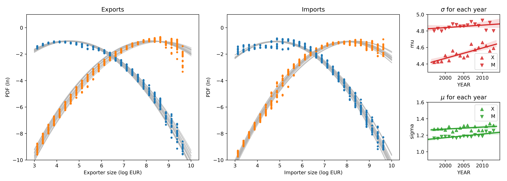

## Size Distribution of Firms

The **size distribution** of firms in the French traders dataset is illustrated in the figure below, with exporters on the left and importers on the right. The distributions for multiple years are superimposed, with blue and yellow dots representing the distribution of the number of agents by size bin and traded value by size bin, respectively. The plots use a **log-log scale**, where log-normal size distributions appear as quadratic parabolas.

It is evident that the size distribution of French traders is compatible with a **log-normal distribution** (truncated at the minimum value $x = 3$). This aligns with previous evidence regarding populations of economic agents. However, there is some drift and widening of the fitted log-normal parameters over the years, suggesting that the size distribution may not be stationary. This widening would be more pronounced if firms experienced random log jumps akin to Brownian motion, indicating that negative autocorrelation of shocks may stabilize agents' time series.

A log-normal size distribution implies a concentration of significant value among the largest agents. For French traders, 90% of exports are concentrated among firms exporting more than $log(s) = x$, and 90% of imports are concentrated among firms importing more than $log(s) = x$.

If we focus on these largest agents, a **Pareto (power law) rule** is also partly compatible with the observed size distribution. Thus, a log-normal and a Pareto rule are not contradictory descriptions of the size distribution of firms. The Pareto model provides a linear approximation to the upper tail of the distribution, making it a useful model for studying the consequences of size distributions, even if not completely accurate empirically.

Both log-normal and Pareto size distributions imply concentration, leading to the familiar 80%-20% concentration rule. This feature highlights the high concentration of value among a small portion of agents, given the empirically observed distribution parameters.

### Formalizing Size Distributions

Consider a histogram that shows the number of agents with total sales in each interval $[\bar s_b, \bar s_b + ds)$ of a partition of the real numbers. The total number of firms is the sum of the population of all bins $N = \sum_{bins} n_j$. If $ds$ is small enough, we can approximate firm sizes by $\bar s_b$. The total value associated with firms in the bin is $S_b = n_b \bar s_b$. The total value disaggregated by firm size is:

$$
X = \sum\limits_{j = 1}^{N} s_j = \sum_{bins} S_b \approx \sum_{bins} n_b \bar s_b
$$

Let us denote firm sizes in linear scale as $s$ and the normalized probability density function (PDF) of firm sizes as $p_{cnt}(s)$. Similarly, there is a PDF of value: $p_{val}(s)$. In the continuous limit, equation becomes:

$$
X = \int X\ p_{val}(s)\ ds =  \int N\ p_{cnt}(s)\ s\ ds      
$$

Here, value $X$ and population $N$ are linked by the fact that the first moment of the value of the population distribution is the zeroth moment of the value distribution. The average firm sales $\bar s \equiv \operatorname{E}[s] = \int s\,p_{cnt}(s)\,ds$ allows us to express $X = N \bar s$. For each size bin: $S_b \approx n_b \bar s_b$.

The integrands in the equation tell us:

$$
X p_{val}(s) = N p_{cnt}(s)\ s\
$$

For a given value $s$, the amount $v_x= X\ .\ p_{val}(s) = N\ .\ p_{cnt}(s)\ .\ s\ $ is how much the holders of such sum hold altogether. For example, if $n_2 = 10^3$ people hold 100 dollars ($10^2$) each, this group has $v_2 = 10^{3+2}= 10^5$ dollars.

From the equation, we see that the distribution of firm sizes $p_{cnt}(s)$ determines the distribution of value $p_{val}(s)$. Using the log variable $t$ in place of $s$, i.e., $s = 10^t = e^{\ln(10) t}$, the size distribution becomes: $p_{cnt}(t) = \mathcal{N}(\mu, \sigma)\sim e^{-a(t - \mu)^2}$. The product of $p_{cnt}(t)$ and $10^t$ results in a shifted parabola $\mathcal{N}(\mu + \ln(10)\sigma^2, \sigma)$, making the distribution of value log-normal if the distribution of agent sizes is log-normal. This shift $ln(10)\sigma^2$ causes the concentration of value among large agents.

The most crucial characteristic of empirical distributions of firm-level sales is their definition on a log scale. They can be expressed as $10^{C(\cdot)}$ with $C(.)$ a normal distribution or an exponentially decreasing distribution (Pareto rule). This has been consistently observed in various populations of economic agents and is key to our study. World trade, split by different categories, also shows log-normal distributions and fluctuations, suggesting broader applicability of these tools.