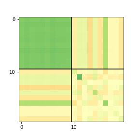
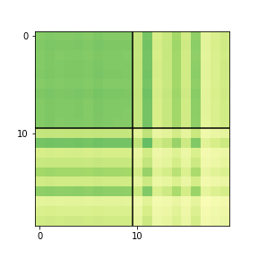
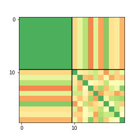

## Simple Structure of Sectoral Sales

Assuming a structure for the time series of sectoral sales involves defining it as a sum of time series that partially compose it. For instance, fitting sectoral sales with a generic $s_{pt}$ results in:

$$
S_p = \hat \beta_p s_t + r_{pt}
$$

This leads to an expression for aggregate variance, which is the sum of elements of the cross covariance matrix:

$$
var(X) = \sum_{ij} cov(S_i, S_j) = \sum_{ij} cov(\hat \beta_i s_t + r_{it}, \hat \beta_j s_t + r_{jt})
$$

Here, $\hat \beta_p$ are elements of $\bm \beta = (s_t^T s_t)^{-1} s_t^T Y$, with $Y \in \mathbb{R}^{T \times P}$ containing the observed parts' time series and $s_t$ as a column vector used for fitting. It can be z-standardized so that $cov(s_t, s_t) = 1$ (see **Figure 4**).

> **Note:** A specific example is fitting (OLS) using a factor of linear time evolution $s_t = t$, then: $S_{pt} = \hat \beta_{p} t + r_{pt}$, where $\beta_{p}$ is as described and $r_{pt}$ are the residuals of the fit.

The elements of the cross covariance matrix are expressed as:

$$
\begin{split}
cov(\hat \beta_i s_t + r_{it}, \hat \beta_j s_t + r_{jt}) = & cov(\hat \beta_i s_t, \hat \beta_j s_t) + cov(\hat \beta_i s_t, r_{jt}) \\
& + cov(r_{it}, \hat \beta_j s_t) + cov(r_{it}, r_{jt})
\end{split}
$$

Each of the $P \times P$ elements is composed of **four** components. Generally, a structure of sectoral sales made from $N$ terms results in $N \times N$ terms forming each element of the cross covariance matrix.

The $\hat \beta$ coefficients are arranged into a column vector $\bm{\hat \beta}$ of length $P$, and the standard deviation of residuals $\sigma$ in the column vector $\bm{\hat \sigma}$ of length $P$. The matrix product $\bm{\hat \beta} \bm{\hat \beta}^T$ creates a $P \times P$ matrix (an outer product), and the cross covariance matrix among sectors is expressed as:

$$
\begin{split}
C = & \bm{\hat \beta} \bm{\hat \beta}^T \cdot C(s_t, s_t) + \bm{\hat \beta} \bm{\sigma}^T \cdot C(s_t, \epsilon_{t}) \\
& + \bm{\sigma} \bm{\hat \beta}^T \cdot C(\epsilon_{t}, s_t) + \bm{\sigma} \bm{\sigma}^T \cdot C(\epsilon_{t}, \epsilon_{t})
\end{split}
$$

where $C({a}, {b})$ denotes the $P \times P$ cross covariance matrix computed from vectors $a$ and $b$. They are multiplied with the outer product matrices element-wise.

 =  × 

**Figure 4:** Structure of cross covariance matrix ($N \times N$ blocks with elements made of outer product times net covariance). This illustration is from a simplified toy example where sectoral time series are decomposed into dependence as mean time series (fitted by OLS) and residuals.

This structure of the cross covariance matrix as an element-wise product of an outer product matrix and a net cross covariance is illustrated in **Figure 4**.

In this context, aggregate variance comprises a **comovement** contribution and an **idiosyncrasies** contribution, apart from cross terms that often do not significantly contribute.

> **Note:** If the time series of the parts are independent, the expectation is $E[var[X]] = \sum_k \sigma^2_k$. The cross covariance terms are, on average, zero, although it is likely that none of them is truly null. They will add up to the uncertainty with which we can estimate $\sigma^2$ as $\sum_k \sigma^2_k$. We maintain cross covariance terms even when their total expectation is zero.