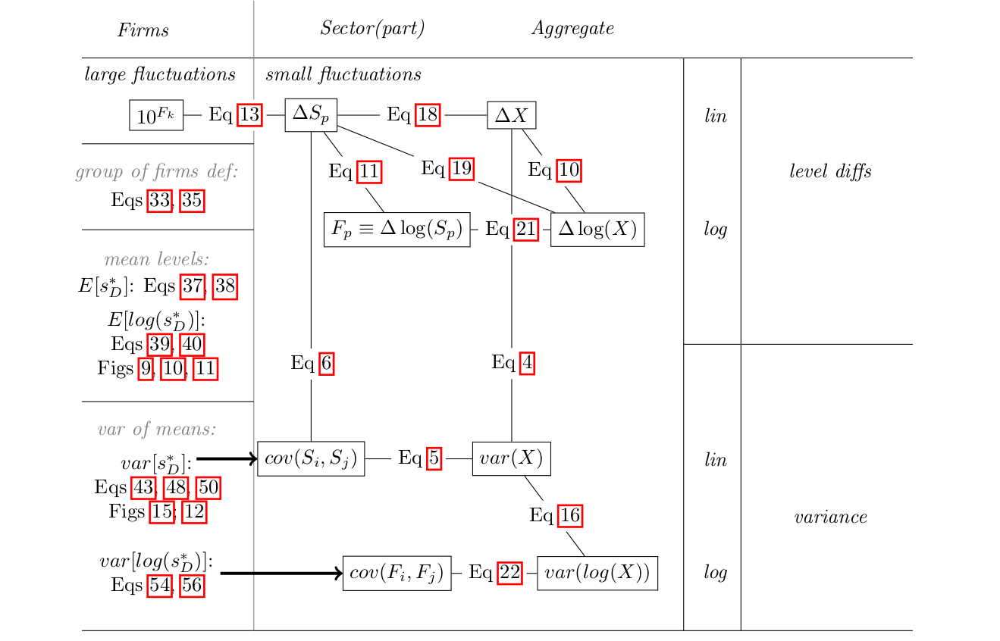

**Understanding the Transition from Micro to Macro Fluctuations**

This section provides an overview of how micro-level fluctuations aggregate into macro-level fluctuations, both in linear and log terms. The scheme in **Figure 1** illustrates the relationships and equations discussed below.

### Key Components

- **Firms**: 
  - Large fluctuations are represented by $10^{F_{k}}$.
  - Group of firms defined by specific equations:
    - *Quantile Sum*: Refer to Eq quantile_sum.
    - *Power Sum*: Refer to Eq power_sum__narrow_bin.
  - Mean levels:
    - $E[s^*_D]$: See Eqs E_N, E_L.
    - $E[\log(s^{*_D})]$: See Eqs Elog_N, Elog_L and Figures Elog_mu0_fnq_0, Elog_sigma0_fmu_0, Elog_mu0_fsigma_0.
  - Variance of means:
    - $var[s^*_D]$: See Eqs alpha_1, var_N, var_L and Figures var_mu0_fsigma_0, fig:var_mu0_fnq_0.
    - $var[\log(s^{*_D})]$: See Eqs var_log_N, var_log_L.

- **Sector and Aggregate**:
  - Level differences:
    - $\Delta S_p$ and $\Delta X$.
    - Equations: $\Delta S_p$ to $\Delta X$ (Eq eqa), $\Delta S_p$ to $F_{p} \equiv \Delta \log(S_p)$ (Eq Ft_def).
  - Variance:
    - $cov(S_{i}, S_{j})$ and $var(X)$.
    - Equations: $cov(S_{i}, S_{j})$ to $var(X)$ (Eq var_cov_sum_def), $cov(F_{i}, F_{j})$ to $var(\log(X))$ (Eq var_log_shocks).

### Equations and Relationships

- **Growth Rate Equation**: 
  - $\Delta X$ to $\Delta \log(X)$ (Eq growth_rates).
- **Variance in Terms of Deltas**:
  - $\Delta X$ to $var(X)$ (Eq var_delta).
- **Logarithmic Relationships**:
  - $F_{p} \equiv \Delta \log(S_p)$ to $\Delta \log(X)$ (Eq parts_linear_approx).
  - $var(X)$ to $var(\log(X))$ (Eq var_log).

This structured approach helps in understanding how individual firm-level fluctuations can aggregate into sectoral or macroeconomic fluctuations, emphasizing the importance of both linear and logarithmic transformations.