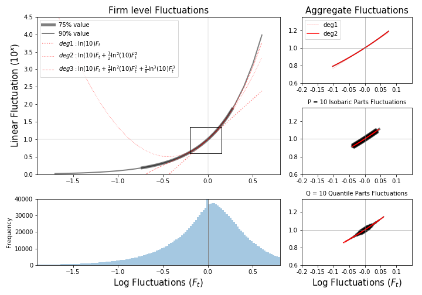

## Firms are not Sectors

As we have noted, the total $X_t$ can be expressed as a sum of parts, in the same way that it is expressed as a sum of firm-level sales:

$$
X_t = \sum_k S_{kt} = \sum_p S_{pt}
$$

Here, $k$ and $p$ index firms and sectors, respectively. Nominal fluctuations of the aggregate can also be expressed as aggregations of firm levels and sectoral levels:

$$
\frac{X_{t}}{\bar X} - 1 = \frac{\Delta X_{t}}{\bar X} = \frac{\sum_k \Delta S_{kt}}{\bar X} = \frac{\sum_p \Delta S_{pt}}{\bar X}
$$

Aggregate fluctuations are usually mild enough to allow a linearization of their log deviations:

$$
\ln(10) \log \left( \frac{X_{t}}{\bar X} \right) 
\approx  \frac{\Delta X_{t}}{\bar X} =
\frac{\sum_k \Delta S_{kt}}{\bar X} = \frac{\sum_p \Delta S_{pt}}{\bar X}
$$

Without loss of generality, we can register the observed deviations from mean levels in log scale. For part $p$, this is $F_{pt} = \log(S_{pt}) - \log(\bar S_{p})$, and similarly, for firm $k$, $F_{kt} = \log(S_{kt}) - \log(\bar S_{k})$. Usually, $F_t$ are small, near-null fluctuations. For example, it could be that $F_t = m_{kt} + \sigma_k \epsilon_{kt}$ with $m_{kt} \ll 1$ and $\epsilon_{kt}$ a time series of random shocks centered at zero with $std(\epsilon_{kt}) = 1$.

This definition of fluctuations implies:

$$
S_{t} = \bar S 10^{F_t}
$$

Both for sectors and firms, nominal fluctuations are:

$$
\Delta S_{t} = S_{t} - \bar S = \bar S (10^{F_t} - 1)
$$

This step is key to matching log shocks observed to nominal shocks that need to be accounted for. The relation between log aggregate sales and log micro shocks to firms or sectors is:

$$
\ln(10) \log \left( \frac{X_{t}}{\bar X} \right) \approx 
 \frac{\Delta X_{t}}{\bar X} =
\sum_k \frac{\bar S_{k}}{\bar X} (10^{F_{kt}} - 1) = 
\sum_p \frac{\bar S_{p}}{\bar X} (10^{F_{pt}} - 1)
$$

We gain substantial insight by considering the actual magnitudes of these $F_t$. Refer to **Figure 1** below, where the left side shows the distribution of $F_{kt}$ observed in firms. The right side shows the aggregate log fluctuations (top), $F_{pt}$ fluctuations in a random partition into $P = 10$ parts (mid), and $F_{qt}$ fluctuations in a quantile partition into $Q = 10$ parts (bottom). The horizontal axis represents log fluctuations, and the vertical axis represents the magnitude of the nominal fluctuations implied by these $F_t$. The black lines represent an exponential curve (base 10), with polynomial approximations in red.

The information from **Figure 1** highlights the magnitude of nominal differences that log fluctuations imply. The thicker curve accumulates 75% of the total value, while thinner ones accumulate up to 90%. Log fluctuations of firms are too wide to proxy the implied nominal fluctuations by means of a linear dependence.

Sectoral fluctuations (10 parts), on the contrary, are mild enough to allow this linearization, and we can largely benefit from this. Sectors will adapt to the following rule:

$$
\Delta \log(X_t) \approx  \frac{1}{\ln(10)}  \frac{\Delta X_{t}}{\bar X} 
= \frac{1}{\ln(10)} \frac{\sum_p \Delta S_{pt}}{\bar X}  
\approx \sum_p \frac{ S_{pt}}{\bar X} F_{pt}
$$

The rightmost term is now a linear combination, as opposed to a sum of nonlinear functions. At the firm level, we must retain the original equation, as using the linear approximation would be grossly incorrect. If the micro shocks are too large, the Taylor series approach for $10^F$ will not work unless we include too many orders, which is impractical.