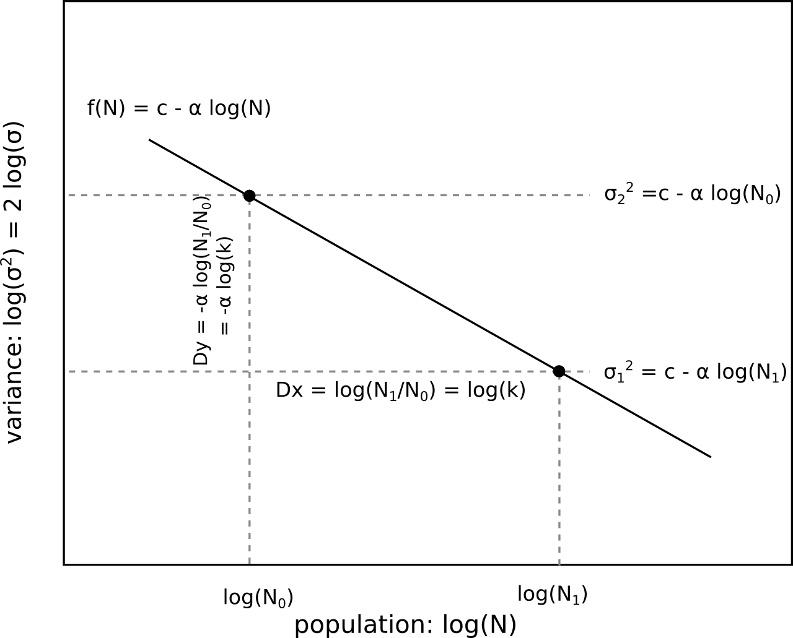
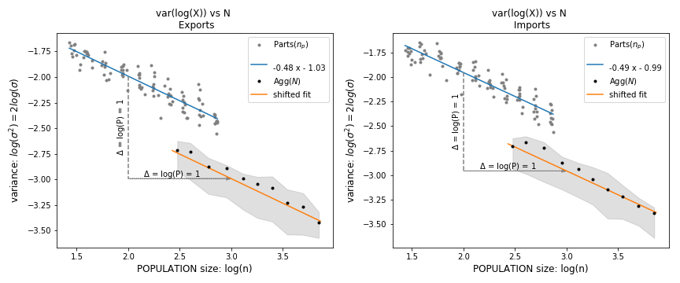

**Understanding the Dependence of Variance with Population Size**

The framework in this section is useful for approaching the problem of dependence with population size ($N$). We denote a reference population size as $N_0$ and consider a different population size $N_1 = k\ N_0$.

A power law of variance with $N$ implies a linear relation between $\log(\sigma^2)$ (equivalent to $2 \log(\sigma)$) and $\log(N)$. The slope of this line is $-\alpha$, which determines the ratio $Dy/Dx$. If we consider two populations, where the second is a multiple $k$ of the first, then $Dx = \log(k)$, and the difference in variance between these two populations is given by $-\alpha Dx = -\alpha \log(k)$. These relationships apply not only to the total population but also to its parts.

To link changes in total population to changes in parts' population, consider: if we sample $N_1 = k\ N_0$ agents from a population, on average, the population of each part $p$ is $k\ n_p(N_0)$, where $n_p(N_0)$ is the expected population at part $p$ when the total population size is $N_0$. In logarithmic scale, this means that if $\log(N_1) = \log(N_0) + \log(k)$, then $\log(n_p(N_1)) = \log(n_p(N_0)) + \log(k)$ for all parts $p \in P$.

Empirically, the dependence of a part's log variance with changes in the part's log population can be approximated qualitatively by a line of slope $-\alpha$:

$$
\log(\sigma^2_p(n_p)) = c - \alpha_p \log(n_p) \Leftrightarrow \sigma^2_p(n_p) = \frac{10^c}{n_p^{\alpha_p}}
$$

The accuracy of this model can be tested a posteriori. When changing $n_p$ for $k n_p$, the levels of $\log(\sigma^2_p)$ change as:

$$
\log(\sigma^2_p(n_p(N_0))) - \alpha_p \log(k) = \log(\sigma^2_p(k\ n_p(N_0))) \hspace{.5cm}
\Leftrightarrow \hspace{.5cm}
\frac{1}{k^{\alpha_p}} \sigma^2_p(n_p(N_0)) = \sigma^2_p(k\ n_p(N_0))
$$

If all parts $p$ present a common $\alpha_p \equiv \alpha$ exponent, then when replacing this value in the expression of the idiosyncratic term of aggregate variance, the dependence with $\alpha$ comes out as a common factor:

$$
\frac{1}{k^\alpha} \frac{1}{P^2} \sum_p \sigma^2_p(n_p(N_0)) = \frac{1}{P^2} \sum_p \sigma^2_p(k\ n_p(N_0))
$$

Thus, the relation shown by the parts is itself valid for the aggregate:

$$
\log(\sigma^2_\epsilon(N_0)) - \alpha\ \log(k) = \log(\sigma^2_\epsilon(k\ N_0))\hspace{.5cm}
\Leftrightarrow \hspace{.5cm}
\frac{1}{k^\alpha} \sigma^2_\epsilon(N_0) = \sigma^2_\epsilon(k\ N_0)
$$

This leads to the equation:

$$
\log(\sigma^2_\epsilon(N)) = c' - \alpha \log(N) \Leftrightarrow \sigma^2_\epsilon (N) = C' N^{-\alpha}
$$

This equation indicates that if we plot the idiosyncratic term of $var(X)$ as a function of population sampling size $N$ in a log-log scale, it will show a slope $-\alpha$.

In the special case where all parts have the same variance $\sigma^2_p$, the idiosyncratic part of aggregate variance fulfills $\sigma^2_\epsilon = P \sigma^2_p/P^2 = \sigma^2_p/P$. Therefore, $\log(\sigma^2_\epsilon) = \log(\sigma^2_p) - \log(P)$. In our case, $P = 10$, so $\log(P) = 1$. This determines the $-1$ variance drop when comparing parts to aggregate.

We have expressed the idiosyncratic part of aggregate variance both as a function of total population $N$ and as a function of parts' population $n_p$. They both should show a common $\alpha$. Empirically, the observed slope $\alpha$ of variance decay with population size is $\alpha_X = -0.48$ for exports data, and $\alpha_M = -0.49$ for imports data. These values were computed from parts' variances (blue lines) and can be extended to describe aggregate idiosyncratic variance (yellow lines).

So far, we can measure the rate of decay of aggregate variance with population size ($\alpha$). We know that the rate of decay of parts is related to the rate of decay in the aggregate. However, we have yet to understand why this slope has its particular value. To explore this, we need to examine what occurs within the parts themselves, which will be the focus of the following section.