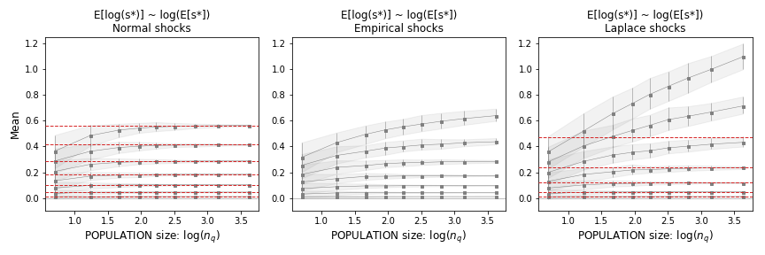
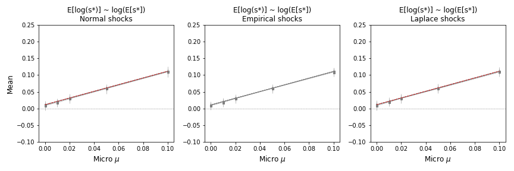
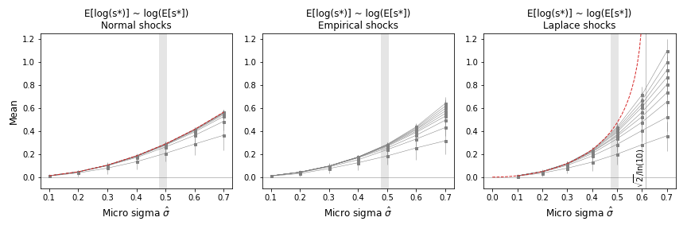

**Understanding Log Quantile Levels**

To analyze the behavior of $log(S_q/S_0)$, we utilize the relationship between the expectation of a random variable and its log level. When fluctuations in the quantile part are not excessively large, the approximation $E[\log(s^*_{D})] \approx \log(E[s^*_{D}])$ holds. By substituting this into the relevant equations, we derive:

- For log-normal shocks:
  $$E[\log(s^*_{N})] \approx \log(M_N) = \mu + \frac{\hat \sigma^2 \ln(10)}{2}$$

- For log-Laplace shocks:
  $$E[\log(s^*_{L})] \approx \log(M_L) = \mu + \log \left( \frac{1}{1 - \frac{1}{2} \hat \sigma^2 \ln^2(10)} \right)$$

When $n_q$ is sufficiently large, $log(S_q/S_0) \approx log(M_D)$. In the limit of small $\hat \sigma$, the expression simplifies to:

$$\log(M_L) \approx \mu + \frac{1}{2} \hat \sigma^2 \ln(10) + \frac{1}{8} \ln^3(10) \hat \sigma^4 + O(\hat \sigma^6)$$

This indicates a common dependence for both log-normal and log-Laplace fluctuations: $log(S_{qt}/S_0) = \mu + \frac{\hat \sigma^2 \ln(10)}{2}$.

**Quantile Mean Level Expressions**

The expressions for quantile mean level (Eqs. for $E_N$ and $E_L$) and log level (Eqs. for $Elog_N$ and $Elog_L$) are based on the parameters $\mu$ and $\hat \sigma$ of the log micro shocks distribution. These parameters determine the limits at large $n$. To ascertain how large $n_q$ needs to be for $S_{qt}/S^0_q \approx M_D$, refer to **Figure 1** below.

**Key Observations**

- Empirical fluctuations with an average $\hat \sigma = 0.49$ do not diverge as seen with log-Laplace shocks when $\hat \sigma > 0.61$.
- The convergence of the mean for empirical shocks is slower than that for log-normal fluctuations with the same $\hat \sigma$.
- **Figure 1** illustrates the convergence of means across the range of $n_q$ parameters relevant to the problem.

**Figures and Analysis**

- **Figure 1**: Expectation of the log of quantile levels as a function of population $n_q$ for various widths of micro shocks $\hat \sigma$ and $\mu = 0$. It shows the convergence of mean values to those predicted by the equations for log-normal and log-Laplace shocks, especially when micro log shocks are Gaussian.

  

- **Figure 2**: Expectation of the log of quantile levels as a function of $\mu$ for various $n_q$ and $\hat \sigma = 0.1$. This figure highlights the linear dependence of slope 1 in the equations.

  

- **Figure 3**: Expectation of the log of quantile levels as a function of $\hat \sigma$ for various $n_q$ and $\mu = 0$. It shows the quadratic dependence in log-normal shocks and higher-order terms in log-Laplace shocks. The expectation diverges for $\hat \sigma > 0.61$.

  

For detailed computational exercises and guides, refer to the Appendix.