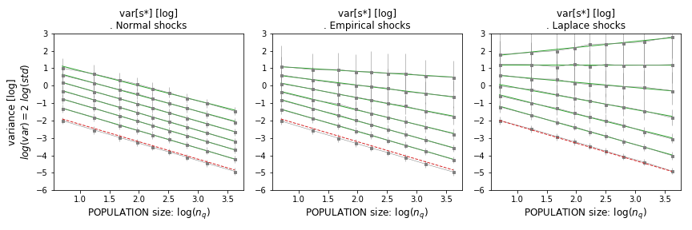
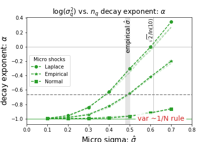

## Variance of Parts' Time Series Mean (The Law of Large Numbers)

In this section, we explore the variance of the time series mean for quantile levels, considering the implications of the law of large numbers. 

We have postulated that the levels $\tilde M_t = S_{qt} / S_0$ shown by a quantile $q$ are drawn from a hypothetical distribution $s^*_D$. Although we do not know the specifics of this distribution, we can approximate its 'true' mean $M_D$ by averaging the levels shown by $n_q$ agents.

### Variance Calculation

To determine the variance of this mean $\tilde M_t$, consider $\tilde M_t$ and $10^{D_{it}}$ as time series of $T$ realizations of the observed average $\tilde M_t$ and observed fluctuations $D_{it}$ of agent $i$ at time step $t$. The variance is given by:

$$
var[ \tilde M_t ] = var\left[ \frac{1}{n_q } \sum\limits_i^{n_q}  10^{ D_{it}} \right] = \frac{1}{n^2_q }  var\left[ \sum\limits_i^{n_q}  10^{ D_{it}} \right]
$$

Assuming the fluctuations for each $i$ are uncorrelated, i.e., $cov[10^{D_{it}}, 10^{D_{jt}}] = \delta_{ij} var[10^{D_{it}}]$, and the variance for each agent $i$ is roughly the same, $var[10^{D(\cdot)}]$, we find:

$$
var\left[ \sum\limits_i^{n_q}  10^{ D_{it}} \right] = n_q var[10^{D(\cdot)}]
$$

Thus, the variance of $\tilde M_t$ approximates to:

$$
var[ \tilde M_t ] \approx \frac{1}{n^2_q } \sum\limits_i^{n_q}  var[ { 10^{ D_{it}} }] =  \frac{1}{n^2_q } n_q var[10^{D(\cdot)}] = {n_q^{-1}} var[10^{D(\cdot)}]
$$

This is a 'law of large numbers' situation.

### Computational Tests and General Expression

Computational tests reveal that the variance of parts' mean follows a more general expression:

$$
var[ \tilde M_t ] = {n_q^{-\alpha}} var[10^{D(\cdot)}]
$$

with $\alpha \leq 1$. This can be seen as a 'postponement' of the law of large numbers.

*Figure: Variance of quantile levels as a function of $n_q$, for various levels of micro fluctuations $\hat \sigma$ and $\mu = 0$. In the limit of small fluctuations, the LLN applies (red). As $\hat \sigma$ grows, variance decay with population size is milder, although still dominant.*

### Implications and Observations

The expression of the variance of mean of part $q$ vs. part's population $n_q$ as a power law with exponent $\alpha$ aligns with the models of volatility vs. population size. If parts follow such a power law, then the aggregate inherits an average of their rate of decay. A power law for parts translates to an analogous 'large number postponement' power law for the idiosyncratic part of aggregate variance.

#### Mechanism Behind $\alpha < 1$

The mechanism allowing $\alpha$ to be smaller than 1 is illustrated in the following figure, which plots the parameter $-\alpha$ as a function of the width of micro fluctuations $\hat \sigma$.

*Figure: Decay rate of quantile variance with population size as a function of width of micro shocks $\hat \sigma$. The bottom level implies fast law of large number convergence.*

The observed values of $\alpha$ depart from the naive diversification rule, where variance falls as $1/n_q$. As $\hat \sigma$ increases, $\alpha$ departs from $-\alpha = -1$, especially for fat-tailed distributions like log-Laplace. In empirical scenarios, firm-level shocks are large, suggesting $-\alpha \approx -0.6$, largely independent of mean micro shocks $\mu$.

In summary, while the law of large numbers provides a baseline for understanding variance decay, real-world data and computational tests suggest more complex dynamics, particularly in the presence of significant micro fluctuations.