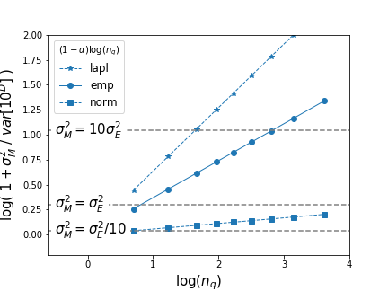

In this section, we delve into the intriguing dynamics of **comovements** and **variance** within the context of large numbers. Specifically, we explore why certain departures may appear as milder power laws and how this might be explained by future studies. Here's a hint that can already provide some insights.

### Key Considerations

- **Large Numbers Condition**: The expression $-\alpha = -1$ from equation alpha_minus_1 assumes no correlations among the time series $10^{D_{it}}$ of agents $i$ belonging to part $q$. 

- **Non-zero Net Cross Covariances**: Allowing non-zero net cross covariances among firms within a part leads to an alternative expression for equation alpha_1:

  $$ var[ \tilde M_t ] = {n_q^{-\alpha}} var[10^{D(\cdot)}] =  \underbrace{cov(10^D)}_{\text{$\sigma^2_M $}}  +  \frac{1}{n_q}  var[ { 10^{ D_{it}} }] $$

  Here, $\sigma^2_M$ represents an unknown comovement, and $cov(10^D)$ denotes covariance terms among agents, functioning similarly to $var[10^D]$.

### Contributions to Variance

- **Idiosyncratic Variances**: Each agent contributes $var[10^{D(\cdot)}]$.
  
- **Comovement Part**: Adds a contribution $\tilde \sigma^2_M \equiv n_q \sigma^2_M$ per agent.

  $$ var[ \tilde M_t ] = \frac{1}{n_q} ( \underbrace{n_q cov(10^D)  }_{\text{$\tilde \sigma^2_M $}}    + \underbrace{var[10^{D_{it}}]  }_{\text{$ \sigma^2_E $}} ) $$

### Relation Between Comovement and Variance

Adopting a per agent basis comparison between comovement and $var[10^D]$ contributions reveals:

$$ n_q^{1 - \alpha} =1 +  \frac{\tilde \sigma^2_M}{var[ { 10^{ D_{it}} }] } $$

This can be rewritten as:

$$ (1 - \alpha) \log(n_q) = \log \left( 1 +  \frac{\tilde \sigma^2_M}{var[ { 10^{ D_{it}} }] } \right) $$

This relationship is visually represented in **Figure alpha_comov_0**, illustrating the balance between self-variance per agent ($var[10^{D_{it}}]$) and covariance per agent ($n_q cov(10^D)$) as a function of the part's population $n_q$.

**Figure alpha_comov_0**: The balance between variance $var[10^D]$ and covariance per agent $\tilde \sigma^2_M = n_q cov(10^D)$ is shown as a function of population size $n_q$. The slopes represent the rate of variance decay with population $\alpha$, given the distribution of micro shocks, here at $\hat \sigma = 0.5$. This plot indicates the importance of comovements among firms of a quantile given its population. For large firms with $n_q < 10$, $\tilde \sigma^2_M \approx \sigma^2_E$. In contrast, in large groups of smaller firms, the net contributions $\tilde \sigma^2_M = n_q cov(10^D)$ outweigh the averaging effect of $var[10^D]$.

### Conclusion

The slope of the lines, $\alpha$, indicates the decay of variance with population size, particularly relevant when micro fluctuations are fat-tailed. The plot suggests that if comovement as in equation alpha_comov2 explains the departure from the Law of Large Numbers (LLN), it shows how significant the covariance of an agent is compared to its variance.

In groups with few large firms, convergence is limited by self-variance and comovement contributions. Conversely, in groups with many small agents, comovement among agents mainly contributes to $var[\tilde M_t]$. Despite this, the averaging effect of large numbers still reduces volatility in large groups of small agents, while groups of few large agents remain more volatile.