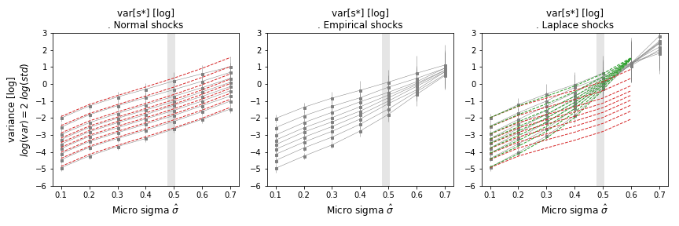

## $var[10^{D_{it}}]$ as a Function of Micro Moments $\mu$, $\hat \sigma$

To advance further, we can use expressions for the moments of the distributions of log shocks into $var[ 10^{D(\cdot)} ] = E[ 10^{2D(\cdot)} ] - E^2[ 10^{D(\cdot)} ]$. By expressing the variance of the mean shown by a quantile part in terms of the moments of the micro distribution of shocks, $\mu$, $\hat \sigma$, we get:

$$
var[ \tilde M_t ] = {n_q^{-\alpha}} var[10^{D(\cdot)}] =  {n_q^{-\alpha}} 10^{2 \mu} f(\hat \sigma) \approx {n_q^{-\alpha}} 10^{2 \mu} \left(\hat \sigma^2  + o(\hat \sigma^4) \right)
$$

The functions $f(\hat \sigma)$ are derived from the moments of the distribution of micro deviations. This is further developed in the appendix for the ideal cases of log-normal and log-Laplace micro shocks.

### Log-Normal Distribution

For log-normally distributed firm-level shocks, $D(\cdot) = N(\mu, \hat \sigma)$, we have:

$$
var[ 10^{N(\cdot)} ] = 10^{2 \mu + \hat \sigma^2 \ln(10) } (10^{\hat \sigma^2 \ln(10) } - 1)
$$

In the limit of very small micro fluctuations:

$$
var[ 10^{N(\cdot)} ] \approx 10^{2 \mu}\left( \hat \sigma^2 +\frac{3}{2} \hat \sigma^4 + o (\hat \sigma^6) \right)
$$

### Log-Laplace Distribution

For log-Laplace distributed firm-level shocks, $D(\cdot) = L(\mu, \hat \sigma)$, the variance is given by:

$$
var[ 10^{L(\cdot)} ] = 10^{2 \mu} \left( \frac{1}{1 - 2 \hat\sigma^2} - \frac{4}{(4 - \hat\sigma^2)^2} \right)
$$

In the limit of small micro fluctuations:

$$
var[ 10^{L(\cdot)} ] \approx 10^{2 \mu}\left( \hat \sigma^2 +\frac{13}{4} \hat \sigma^4 +  o (\hat \sigma^6)\right)
$$

These expressions for $var[10^{D_{it}}]$ allow us to express $var[\tilde M_t]$ in terms of the micro moments $\mu$ and $\sigma$. For the moment, the correct expression for a term like $cov(10^D)$ is still under development. However, by examining the equations, we expect it to be of the type: $cov(10^D) = 10^{2\mu} f(\hat \sigma)$.

**Figure**: Variance of quantile levels as a function of the width of micro fluctuations $\hat \sigma$, for various population sizes $n_q$ and $\mu = 0$. Log-normal (left), empirical (mid), and log-Laplace (right). The contribution from self variance follows the $1/n_q$ rule (red). In green, for the log-Laplace case, acknowledgment of comovements as a product of micromoments with population size $n_q$. The magnitude of empirical $\hat \sigma$ is shown with a vertical gray band.

### Nonlinearities and the Law of Large Numbers

The $\sigma^2$ contribution shows cancellation of opposite shocks and convergence of the mean, as when averaging a time series showing additive deviations from a level. Both log-normal and log-Laplace shocks contain this $\hat \sigma^2$ dependence. However, these multiplicative micro shocks have additional higher-order terms $o(\hat \sigma^4)$ that grow as micro fluctuations are turned on. These nonlinearities make multiplicative shocks different from additive Gaussian shocks and are particularly stronger if micro shocks are fat-tailed (log-Laplace).

In summary, nonlinearities contribute to variance, but the law of large numbers and its 'postponement' are distinct features. For small fluctuations applicable to any distribution of micro shocks if $\hat \sigma$ is small enough:

$$
var[ \tilde M_t ] = {n_q^{-\alpha}} var[10^{D(\cdot)}] =10^{2\mu} \left( f(\hat \sigma)  + \frac{1}{n_q} \left(  \hat \sigma^2 + o(\hat \sigma^4)\right)\right)
$$

The expression for $f(\hat \sigma)$ likely starts with a term of order $o(\hat \sigma^4)$. If we consider only the $o(\hat \sigma^2)$ terms, we remain in the linear setting:

$$
var[\tilde M_t] = 10^{2 \mu} \hat \sigma^2 / n_q
$$

Without the comovement term, nonlinearities alone would increase the variance, although the law of large numbers would still apply. The breaking of this rule is due to comovements across agents, activated by nonlinearities that are absent in the additive Gaussian case, making comovement terms per agent $n_q$ times stronger than self-agent variance $var[10^D]$.