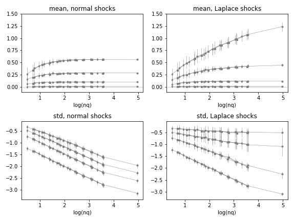

## Acknowledging Size Distribution

Results in the preceding section were derived under the condition that all firms in a part are of the same size. This **narrow quantile** condition implies abstracting away from the sizes of agents. In that context, we have seen that the mean value and variance of the mean that a group of agents presents can be approximated by functions of the moments of the distribution of micro shocks, $\mu$ and $\hat \sigma$. The variance of the mean has been seen to also follow a $n_q^{-\alpha}$ dependence with the number of agents in the quantile part. But how are these results changing if we acknowledge firms in a quantile part are not all of the same size?

A simple and decisive way to test the robustness of these results is to repeat the computations in a generalized setting. Therefore, I repeat the experiments with firm sizes given by three ideal size distributions with parameters matching those observed in the population of French traders. We have seen that outcomes involving empirical growth rates are always in between the outcomes with log-Laplace shocks and log-normal shocks. For simplicity, I apply fluctuations given by these two models.

Firm levels in the zero fluctuations data are given by levels of the cumulative density functions (CDF) of the following distributions: 

- **Lognormal Distribution**: $x \sim \text{Lognormal}(\mu = 4.54, \sigma = 1.28, N)$, for $x>3$

  The $x>3$ is a clipping that imitates the censoring of actual data.

Next size distribution we consider is the upper tail of the previous distribution, which contains $90\%$ of the value. That is:

- **Upper Tail Lognormal Distribution**: $x \sim \text{Lognormal}(\mu = 4.54, \sigma = 1.28, N')$, for $x > x(q_{1/10}) = 6.67$

We also consider the Pareto distribution that fits this upper tail.

- **Pareto Distribution**: $x \sim \text{Pareto}(z_0 = -1.10, s_m = 6.37, N')$, for $x > x(q_{1/10}) = 6.67 \equiv x_m$

The resulting dependence of mean of quantile levels, and variance of this mean is summarized in the plots of **Figure 1**. Top plots show mean level of the quantiles as a function of quantile population $\log(n_q)$, bottom plots are for variance of mean of the quantiles as a function of quantile population $\log(n_q)$. Left side plots show results applying log-normal shocks and right side plots show results applying log-Laplace shocks. In all cases, mean micro fluctuation parameter is set to $\mu = 0$, and each of the many curves are for multiple possible values of the width of micro fluctuations $\hat \sigma$, in increasing levels from nearly zero up to their actual magnitude $\hat \sigma \approx 0.5$.

The outcomes suggest that $E[s^*_D]$ and $var[s^*_D]$ are functions of the micro moments $\mu$, and $\hat \sigma$, but most importantly, they are showing that these moments of the quantile time series are functions of the population $n_q$ that apply regardless of what is the size distribution. Changing the size distribution changes the set of $n_q$ values describing quantile population, but the functions derived in the previous section always apply in the same way.

The first of the size distributions used in this experiment includes the large number of smallest firms that accumulate 10\% of the value. The results suggest that this subpopulation of firms qualitatively follows the same pattern as the remaining parts. The matching, however, is not complete, so it may be advisable to follow this quantile (which in the end includes the majority of agents) in a separate account. In practical applications, this small firms quantile can be left out because it weighs only a minority of total value, but this depends on the intended application.

Footnotes:

1. The parameters of these distributions match the empirical distribution of exports by firm. The experiment is repeated on analogous synthetic zero fluctuation data matching parameters of imports at the firm level, with equivalent results.

2. The empirical size distribution of French trading firms is bound from below at $x = 3$, i.e., $s = 1000EUR$. Because most value is on the other end of the distribution, this is not critical for results. However, for examples of how this type of censoring feature could be treated in general, see Yamamoto (2014) where moments of a clipped log-normal are studied for an application on a practical problem. Computational results necessarily incorporate this feature.