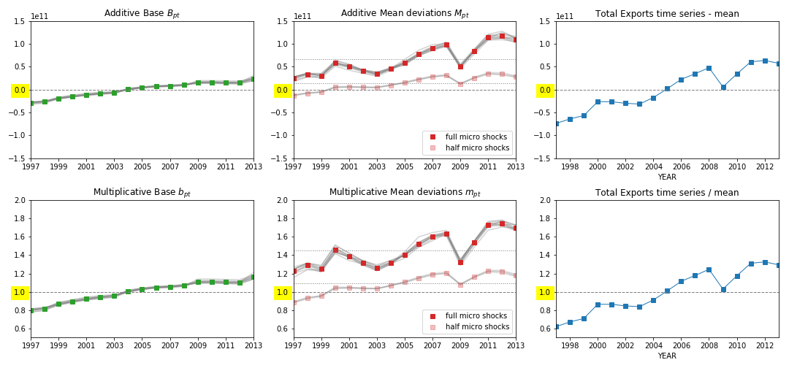

## Acknowledging Entry and Exit Events

In this section, we explore the dynamics of entry and exit events in firms and their impact on sectoral sales time series. This is crucial for extending the formal framework to account for the active or inactive status of firms over time.

Consider the decomposition of sectoral sales time series $S_{pt}$:

$$
S_{pt} = \bar S_p + \Delta S_{pt} = S^0_p + B_{pt} + M_{pt} + E_{pt}
$$

- **$\bar S_p$**: The observed mean of the time series.
- **$\Delta S_{pt}$**: Deviations from the mean level.
- **$B_{pt}$**: Accounts for nominal fluctuations, especially due to entry and exit events.
- **$M_{pt}$**: Captures contributions related to comovements.
- **$E_{pt}$**: Captures contributions related to sectoral idiosyncrasies.

The relationship implies $S_{pt} - S^0_p = B_{pt} + M_{pt} + E_{pt}$, where $S^0_p$ is observed when all fluctuations are removed. Note that $\bar S_p$ includes the net mean of the $B, M, E$ terms.

Given that $X_t = \sum_p S_p$, the variance is:

$$
\sigma^2(X_t) \equiv \sum\limits_{i, j \in P} Cov(S_i, S_j)
$$

The covariance decomposition is:

$$
\begin{split}
cov(B_{it} + M_{it} + E_{it}, B_{jt} + M_{jt} + E_{jt}) = & cov(B_{it}, B_{jt}) + cov(B_{it}, M_{jt}) + cov(B_{it}, E_{jt}) \\
+ & cov(M_{it}, B_{jt}) + cov(M_{it}, M_{jt}) + cov(M_{it}, E_{jt}) \\
+ & cov(E_{it}, B_{jt}) + cov(E_{it}, M_{jt}) + cov(E_{it}, E_{jt})
\end{split}
$$

*Figure: Base components $B_{pt}$ (green, left), Mean fluctuation components $M_{pt}$ (red, middle), and actual total exports time series.*

Log fluctuations can be similarly decomposed:

$$
\log(S_{pt}) = \log(\bar S_p) + F_{pt} = \log(S^0_p) + b_{pt} + m_{pt} + \sigma_p \epsilon_{pt}
$$

- **$\epsilon_{pt}$**: A random variable with mean zero and std = 1.

This implies:

$$
\log(S_{pt}/S^0_p) = b_{pt} + m_{pt} + \sigma_p \epsilon_{pt}
$$

The relationship to nominal accounts is:

$$
S_{pt} = S^0_p + B_{pt} + M_{pt} + E_{pt} = S^0_p 10^{b_{pt} + m_{pt} + \sigma_{p} \epsilon_{pt}}
$$

Consider a thought experiment where fluctuations are 'turned on' from zero to actual magnitudes. Initially, $\log(S_{pt}/S^0_p) = b_{pt}$. As shocks are activated, we observe differences as:

$$
\log(S'_{pt}) - \log(S_{pt}) = \delta_{pt} = m_{pt} + \sigma_p \epsilon_{pt}
$$

The width of this time series is $\sigma = \sqrt{\sigma_{\delta}^2 + \sigma_b^2}$. Depending on the magnitude of micro shocks and firm dynamics, different sources may explain observed aggregate volatility.

For mild sectoral fluctuations, the covariance matrix elements are:

$$
\begin{split}
cov(\log(S_{it}), \log(S_{jt})) = & cov(b_{it} + m_{it} + \sigma_i \epsilon_{it}, b_{jt} + m_{jt} + \sigma_j \epsilon_{jt}) \\
= & cov(b_{it}, b_{jt}) + cov(b_{it}, m_{jt}) + cov(b_{it}, \sigma_j \epsilon_{jt}) \\
+ & cov(m_{it}, b_{jt}) + cov(m_{it}, m_{jt}) + cov(m_{it}, \sigma_j \epsilon_{jt}) \\
+ & cov(\sigma_i \epsilon_{it}, b_{jt}) + cov(\sigma_i \epsilon_{it}, m_{jt}) + cov(\sigma_i \epsilon_{it}, \sigma_j \epsilon_{jt})
\end{split}
$$

Each element involves nine terms, combinations of $b, m, \sigma\epsilon$. For $P$ parts, the total variance sums $9P^2$ contributions, with different combinations and cross terms contributing to the aggregate variance.