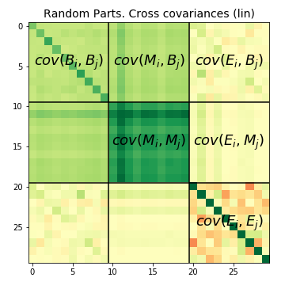
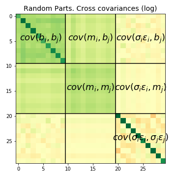
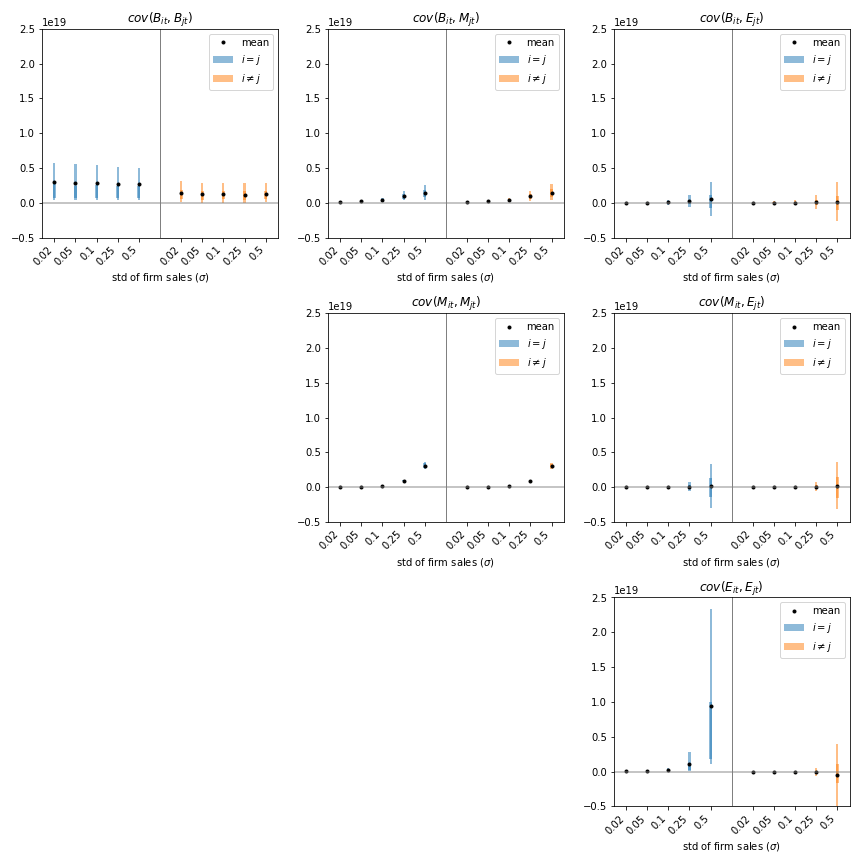

In this section, we explore the **estimated dependence** of components $B_{pt}$, $M_{pt}$, and their counterparts $b_{it}$, $m_{it}$. The time dependence of these components is particularly interesting as they include net comovements, unlike the $E_{pt}$ and $\sigma_p\epsilon_{pt}$ terms, which are centered on zero.

**Figure 1**: Expected values of the cross covariance matrices as described in equations for $BME$ decompositions. Aggregate variance is the sum of all elements of the linear cross covariance matrix, while the log matrix satisfies specific equations. Colors denote negative (red), null (yellow), and positive (green) values. The left side shows the log cross covariance, and the right side shows the linear cross covariance. The extensive margin (top left) exhibits a constant plus diagonal structure. The intensive part is divided into comovement components (estimated by medians across bootstrap samples) and idiosyncratic variance. Correlation between the idiosyncratic and $B$, $M$ components is near null (yellow), as is the idiosyncratic covariance among different parts.

For a detailed procedure on estimating these decompositions, refer to the Appendix. Here, we focus on discussing the outcomes. A brief description of the technique for estimating elements of the covariance matrix is provided in the footnote[^1].

In **Figure 1**, the mean magnitude of elements of the cross covariance matrix of linear (left) and log (right) sectoral time series is illustrated. Green elements are positive and add to aggregate variance, while yellow elements are near null.

- The top row and left column of blocks represent the **extensive margin**.
- The top left $cov(B_i, B_j)$ block shows the extensive part of covariance among parts, confirming the general comovement plus idiosyncratic pattern observed throughout this work (see [Section: BME Decomposition](./bme-decomposition.md)).
- Partial correlation between the extensive margin and the intensive comovement is observed in the $cov(M_i, B_j)$ and $cov(B_i, M_j)$ blocks, as expected.
- The $cov(M_i, M_j)$ block contributes most to aggregate variance in our empirical case.
- The idiosyncratic block $cov(E_i, E_j)$ is mostly diagonal, as expected.

**Figure 2**: Cross covariance terms of equations for $BME$ decompositions, showing expected values for increasing levels of microshocks. The vertical scale is shared across plots. The 3x3 boxes arrange combinations of $B$, $M$, $E$ components, with blue and yellow sides distinguishing diagonal (part variance) from off-diagonal elements. Black dots denote mean values, and lines show 25% to 75% quantiles estimated from bootstrap. Note that the magnitude is that of single elements, which need to be summed to arrive at the variance contribution of each block. For example, comovement elements (mid, mid) are smaller than idiosyncratic ones (bottom left), but they are $P$ times as many.

[^1]: For the estimation of BME decompositions, a bootstrapping approach is used, involving multiple iterations (e.g., 100 times). In each run, half of the firms are randomly sampled, and a partition into $P = 10$ random parts is designed. Firm sales levels are forced to not deviate from their mean, forming the base time series. Firm-level fluctuations are then added, and differences from the base level are measured as $\delta_{pt} = m_{pt} +\sigma_p \epsilon_{pt}$. The median across bootstrap repetitions estimates $m_{pt}$, and subtracting it from actual observations provides an estimate of $\sigma_p \epsilon_{pt}$. This allows examination of all $9 \times P^2$ elements of the cross covariance matrix.