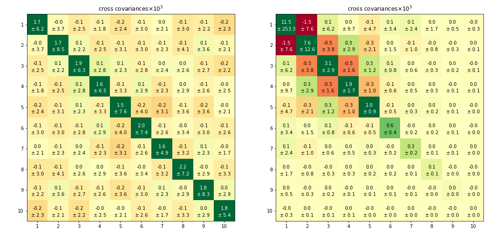

Matrix elements can be classified into their **$3 \times 3$ blocks**, as well as their **diagonal** or **off-diagonal** status. Diagonal elements are those of a part with itself, while off-diagonals are those among different parts. This classification is exploited in **Figure 1** to summarize the dependence of matrix elements on the magnitude of micro shocks $\hat{\sigma}$.

**Key Observations:**

- **Extensive Margin Block:** 
  - Note the lack of dependence on increasing micro shocks, as expected.
  - The relatively higher magnitude of diagonal elements indicates potential for separating comovement from idiosyncratic changes in parts' extensive margin.

- **Covariances of Intensive Comovement:**
  - Elements grow with increasing micro shocks.
  - Diagonal and off-diagonal elements are equivalent.

- **Idiosyncratic Contributions to Aggregate Variance:**
  - These grow as micro shocks are turned on from zero.
  - Off-diagonal terms, expected to be null, appear distributed around zero with increasing width as micro shocks increase.

The correlation between idiosyncratic sectoral components and the comovement time series also shows that off-diagonal elements can contribute positively or negatively to aggregate variance. A method for estimating these contributions is discussed in *Section: Uncertainty* (see [Section: Uncertainty](./uncertainty.md)).

**Figure 2** illustrates mean values of elements in the idiosyncratic block of the log cross covariance matrix and their standard deviation. The benefit of applying equal weight partitions is evident, as matrix elements contribute equally to aggregate variance.

- **Left Side (Random Partitions):**
  - Results are nearly uniform across sectors, with most variance on diagonal elements.
  - Deviations of all values are relatively large, especially the amplitude of off-diagonal terms, which average nearly zero across $M = 200$ bootstrap repetitions.

- **Right Side (Quantile Partitions):**
  - The structure resembles an outer product times a net covariance.
  - Elements on the bottom and right side are associated with large groups of smaller firms.
  - Sample variance decays with population size, resulting in near-null contribution from the smallest firms, aligning with the traditional view where random shocks cancel out.
  - Conversely, the upper left end illustrates granularity, where equal weight groups of fewer firms contribute large magnitude sample variances.

The decomposition into quantile parts reveals significant positive and negative contributions to aggregate variance through cross covariances, particularly in the upper left with large off-diagonal values. This aligns with the outer product of $\bm{\sigma}$ expression, multiplied by $cov(\epsilon_i, \epsilon_j)$ terms, as discussed in *Section: BME1* (see [Section: BME1](./bme1.md)).

**Footnotes:**

1. The detailed breakdown of matrix elements and their implications is crucial for understanding the nuanced contributions to variance in complex systems.