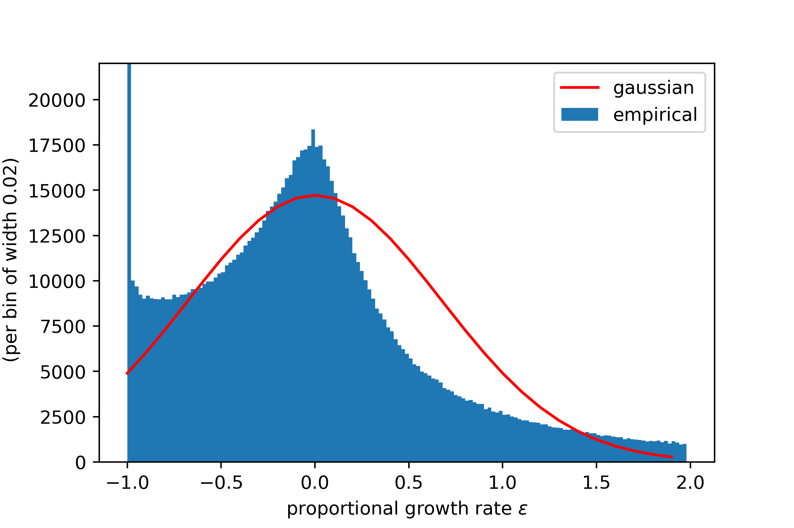

## Appendix II. Gibrat

**On the results attributed to Gibrat (1931)**

Gibrat introduced the concept of the 'law of proportionate effect' amidst a collection of empirical evidence of power law relationships. This law proposes that $dx = k \cdot x$, where the constant $k$ may also be denoted as $\epsilon$. A more generalized expression is $dx = k \cdot (x - x_0)/a$, leading to $k = \frac{a \cdot dx}{x - x_0}$. By proposing a variable $z$ such that $k = dz$ and integrating these differentials, we get $z = a \cdot \log(x - x_0) + b$, which is identifiable with a Pareto relation. This proportionate effect is what present-day writers refer to as the *Pareto relationship*, which Gibrat himself acknowledged.

The assumption that variables have a normal distribution is imposed by Gibrat, rather than derived. He does not propose that growth rates are constant across firm sizes, contrary to some interpretations. For example, some works have suggested that Gibrat's law implies that firm size does not affect growth rate predictions, or that firm size distribution does not matter for policy goals like job creation. However, even if firms share a single growth rate distribution, firm size distribution can still determine where most jobs are created.

## Appendix III. The Problems of Percentual Growth Rates

Percentual growth rates are commonly used due to their straightforward definition. However, they exhibit significant asymmetry in firm sales time series. Notably, they cannot fall below $\epsilon_{min} = -1$ and are unbounded above. This asymmetry is evident in the empirical distribution of firm-level export growth rates, as shown in **Figure 1** below.

**Figure 1**: Distribution of firm year-on-year percentual growth rates, with a Gaussian curve centered at zero and having the same standard deviation. The assumptions in Gabaix (2011) and Foerster (2011) are shown to poorly depict actual empirical observations.

The figure strongly suggests that assuming a normal distribution for percentual growth rates is inadvisable. High skewness can also lead to issues in defining the standard deviation, further complicating the use of percentual growth rates in empirical analyses.