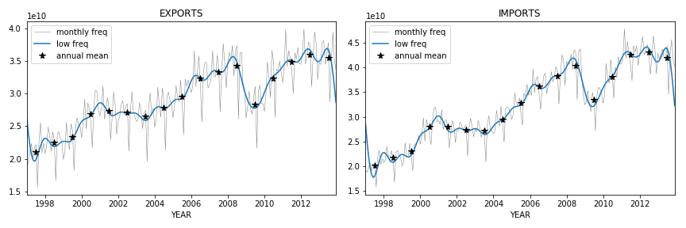

## Appendix II: Accounting Variance by Frequency

The focus of this section is on time series with an **annual frequency**. A common question is whether measuring the same variables at a **higher frequency** significantly alters the observed volatility. The answer is that most of the variation in aggregate sales over time is explained by **low-frequency components**, i.e., cycles longer than a year, which are well captured in annual data. This suggests that measuring volatility on annual time series is a reasonable choice, although some additional volatility linked to seasonal changes might be missed.

To explore this issue, we present the expression for our problem in terms of **Fourier series**, allowing comparability with approaches by Dupor and Horvath.

The time series $\textbf{x}$ considered here have a **monthly frequency** over $T = 17$ years, resulting in a length of $L = 204 = 12T$. They can be expressed as:

$$
\textbf{x} = \sum\limits_{k = 0}^{L - 1} y(k) \exp\left( i 2 \pi \frac{k\ \textbf{x}_{L}}{L} \right)
$$

where $k \in [0, 203]$ is the wave number (minimum to maximum wave frequency), $\textbf{x}_L = (1, ..., L)$ is a vector of time steps, and $y(k)$ is the $k$-th element of the Fourier transform of $\textbf{x}$ divided by $L$, defined as:

$$
y(k) = \frac{1}{L} \sum\limits_{t = 0}^{L - 1} \exp\left(- i 2 \pi \frac{k\ t}{L}\right)  \textbf{x}[t]
$$

Alternative conventions to express these are also valid. From here, we can associate a magnitude of volatility to each frequency $k$ by their amplitude in the equation above, i.e., by the magnitude of $y(k)$, excluding the zero frequency component. This is:

$$
var(\textbf{x}) = \sum\limits_{k = 1}^{L - 1} |y(k)|^{2}
$$

We have information on the **monthly disaggregation** of exports and imports to assess whether most variation is explained by low or high-frequency components. These are illustrated in the plots of **Figure 1**. Annual and lower frequencies are termed low, while frequencies higher than annual are termed high. The only significant high-frequency components are related to **seasonal patterns** (six months, quarters, two months, etc.). For imports, annual or lower frequencies account for **90%** of variance, while for exports, this figure is **75%**.

This result supports the study of variance in annual time series as a fair representation of variance even in higher frequency measurements. Eventually, we might want to add a contribution to aggregate volatility from seasonality, but this is not problematic and is excluded from the rest of the analysis.

