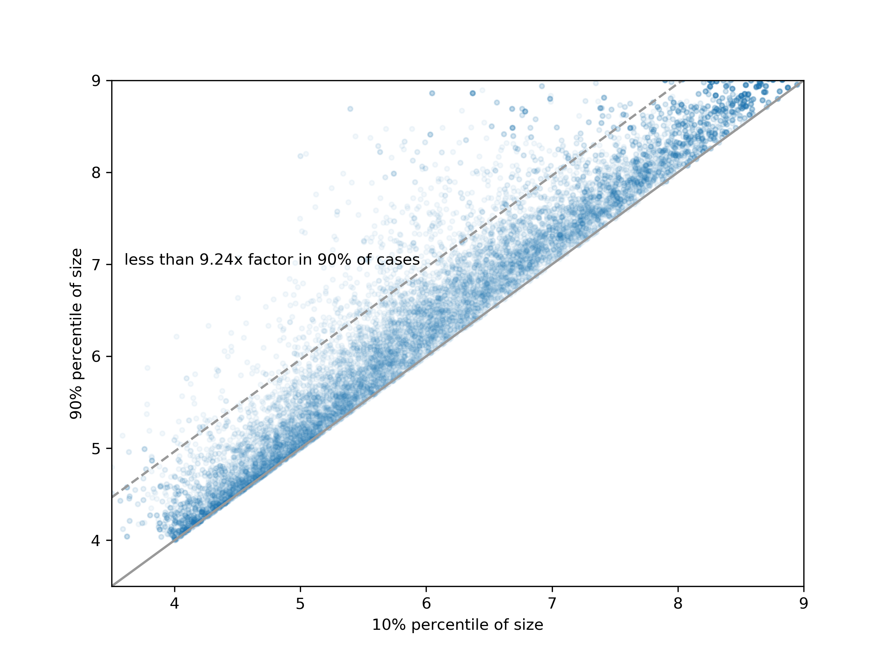

**Appendix V: Persistence of Firm Size**

We have been using the concept of **firm size**, but to what extent can firms be consistently associated with a specific size value? Is there a size *band* from which firms are expected not to escape during their lifetime? This is what we aim to determine here.

This observation has been discussed repeatedly. For example, Hart and Prais (1956) plotted firm sizes at the end versus the beginning of a time period. Experimenting with different definitions, we found that the ratio between the 90% and 10% percentiles of firm size as exporters or importers (12-month rolling average) does not change significantly with size. We can summarize this by stating that for 90% of firms, this ratio is smaller than 9.27. This can be seen as the band of height 0.967 in **Figure 1**. This is not just any fanciful criterion; it allows us to conclude that associating firms with a log-size is meaningful, provided we leave a margin of $\pm 0.5$ uncertainty.

*Figure 1: Gaussian vs non-Gaussian growth rate distribution*

This is one of the reasons we use only $Q = 10$ quantile bins. All experiments are performed on narrower bins as well, without altering the conceptual results.