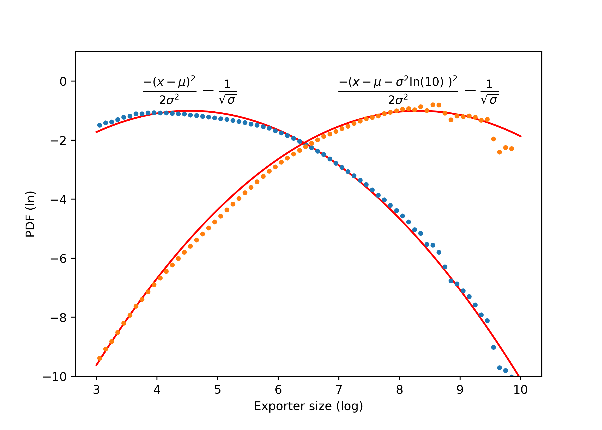

**Understanding the Moment of a Log-Normal in Size Distribution**

The first moment of the log-normal distribution is crucial for deriving the distribution of value from the distribution of population. This concept is significant when considering the average of small multiplicative micro shocks. Notably, Mandelbrot (1997) explores this calculation in the section titled "The lognormal's density and its population moments".

To derive the probability density function (PDF) for value, denoted as $p_{val}(s)$, we apply a log-normal PDF as $p_{cnt}(s)$ in the equation:

$$
X p_{val}(s) = N p_{cnt}(s)\ s\
$$

**Proposed Log-Normal PDF**

The log-normal PDF is expressed as:

$$
p_{cnt}(s) = \frac{1}{s} \cdot \frac{1}{\sigma\sqrt{2\pi}} \exp\left( -\frac{(\ln s-\mu_c)^2}{2\sigma^2} \right).
$$

*Figure 1: Size distribution in log-log scale fitted by log-normal model (parabola). Data from all firm-years available are binned and fitted by OLS. Value distribution (yellow, right) is derived analytically from parameters of agents' size distribution (see expressions annotated and equation lognormal_value).*

**Transformation and Calculation**

By applying the change of variable $x \equiv \log(s)$, and substituting into the equation, the log-normal multiplied by the value variable becomes:

$$
p_{val}(s) ds= \frac{1}{\sigma\sqrt{2\pi}} \exp\left( -\frac{(\ln s-\mu_c)^2}{2\sigma^2} \right) ds
$$

Considering $ds / s = \ln(10) dx$ and substituting $s = 10^{x} = e^{\ln(10) x}$, we derive:

$$
p_{val}(x) ds = \frac{\ln(10)}{\sigma\sqrt{2\pi}} \exp\left( -\frac{(x-\mu_c)^2}{2\sigma^2} \right) \exp(\ln(10) x) dx    
$$

**Final Expression**

The multiplication of counts per the corresponding value is expressed as:

$$
p_{val}(x) ds = \frac{\ln(10)}{\sigma\sqrt{2\pi}} \exp\left( -\frac{(x- (\mu_c + {\sigma}^2 \ln(10)) )^2}{2\sigma^2} + \frac{\sigma - 2 \mu_c}{2\sigma^2} \right) dx
$$

Simplifying further:

$$
p_{val}(x) ds = \exp{\frac{\sigma - 2 \mu_c}{2\sigma}} \frac{\ln(10)}{\sigma\sqrt{2\pi}} \exp\left( -\frac{(x- \mu_v)^2}{2\sigma^2} \right) dx
$$

After normalization, we obtain:

$$
p_{val}(x) ds = \frac{1}{\sigma\sqrt{2\pi}} \exp\left( -\frac{(x- \mu_v)^2}{2\sigma^2} \right) dx
$$

This indicates that the distribution of value is a log-normal with $\mu_v = \mu_c + {\sigma}^2 \ln(10)$ and the same $\sigma$. These are represented by the yellow curves to the right in the plots of **Figure 1**.

**Interpretation**

The parameters of the distribution can be viewed as coefficients of a parabola (see plots in **Figure 1**). The multiplication and normalization in the preceding equations are equivalent to adding a line to the parabola and subtracting a constant to normalize, resulting in a new parabola with the same quadratic coefficient but displaced by ${\sigma}^2 \ln(10)$ to the right.