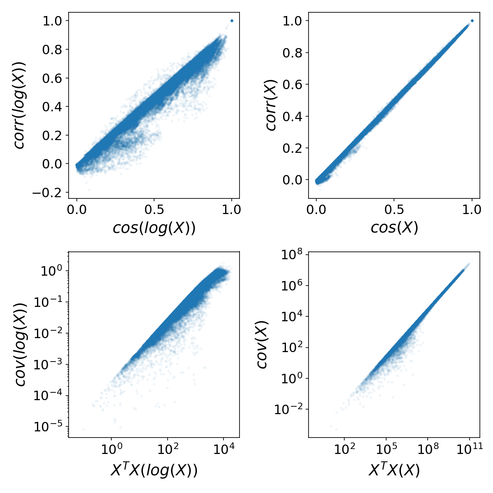
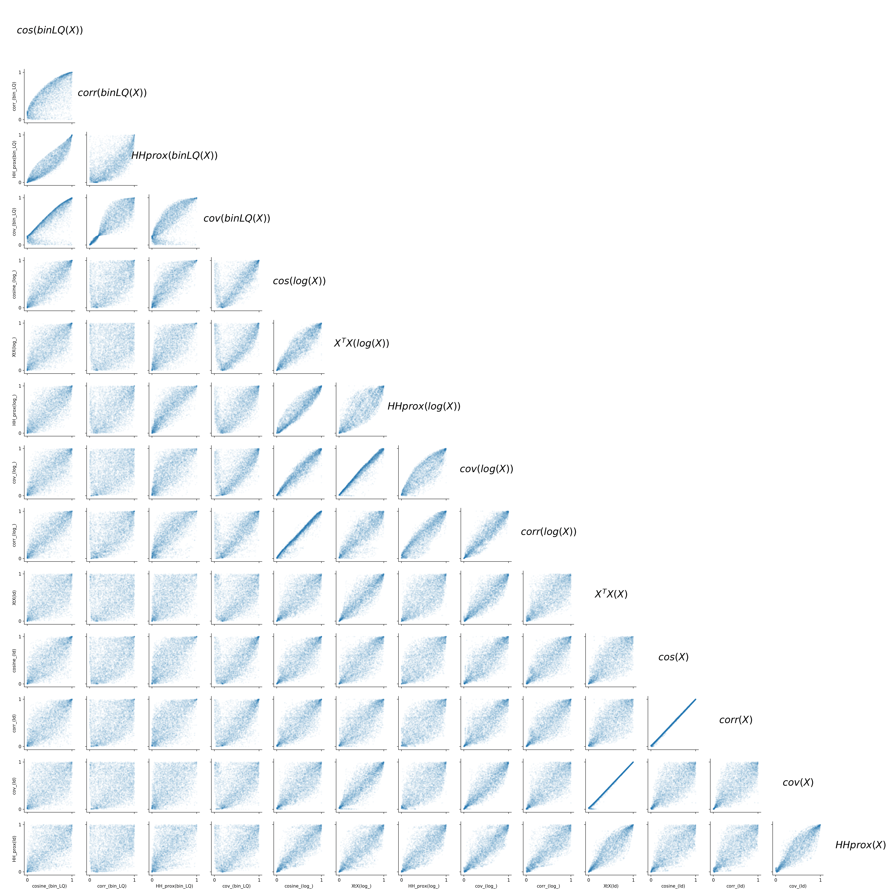

**Exploring Similarity Measures in Employment and Establishment Data**

In this section, we delve into the correspondence of different similarity measures, particularly in the context of employment and the number of establishments by county and industry. Although the conditions for centered and normalized data are not met, it is insightful to examine how these discrete similarity measures align.

### Key Observations

After plotting pairwise similarity values using various discrete similarity measures, we observe a clear correspondence in the following cases:

- **cos(X) $\approx$ corr(X)**
- **$X^T X \propto$ cov(X)**

For the first item, the correspondence is an identity, while for the second, it is a proportionality. These relations hold even when the raw data $X$ is transformed to $\log(X)$, applicable to both employment and establishment data by county and industry. These observations are illustrated in **Figure 1** below, which applies to employment level data. Similar results are seen for establishment data.

*Figure 1: Scatterplots comparing selected industry pair similarity measures from US employment by county data. The top plots depict a near identity, while the bottom plots (log-log scale) show proportionality. The proportionality factor relates to the number of counties.*

### Expanding the Analysis

By broadening the range of possible similarity measures and data transformations, we uncover a family of measures that agree on the most and least similar pairs of activities. This family includes measures applying log transformations, binarized location quotients, or no transformation at all, followed by similarity calculations such as cosine, Pearson correlation, covariance, dot product ($X^T X$), or Hausmann Hidalgo proximity.

All 15 possible combinations are partially equivalent in our setting of employment and establishment data by US county and 4-digit NAICS industry. **Figure 2** below illustrates the specific correspondence between these measures by comparing ranks directly. The closer the points are to the diagonal, the more the rankings match.

*Figure 2: Comparison of rankings for multiple similarity measures applied to employment data by NAICS 4-digit industry and US county, including transformations like logarithm and binarization of location quotient. The diagonal accumulation suggests agreement in extreme cases, indicating these measures capture a single underlying similarity.*

In conclusion, these findings suggest potential paths for unifying methodologies across different studies, as these similarity measures capture a cohesive property of industry pairs, termed as their **'similarity by US counties'**.