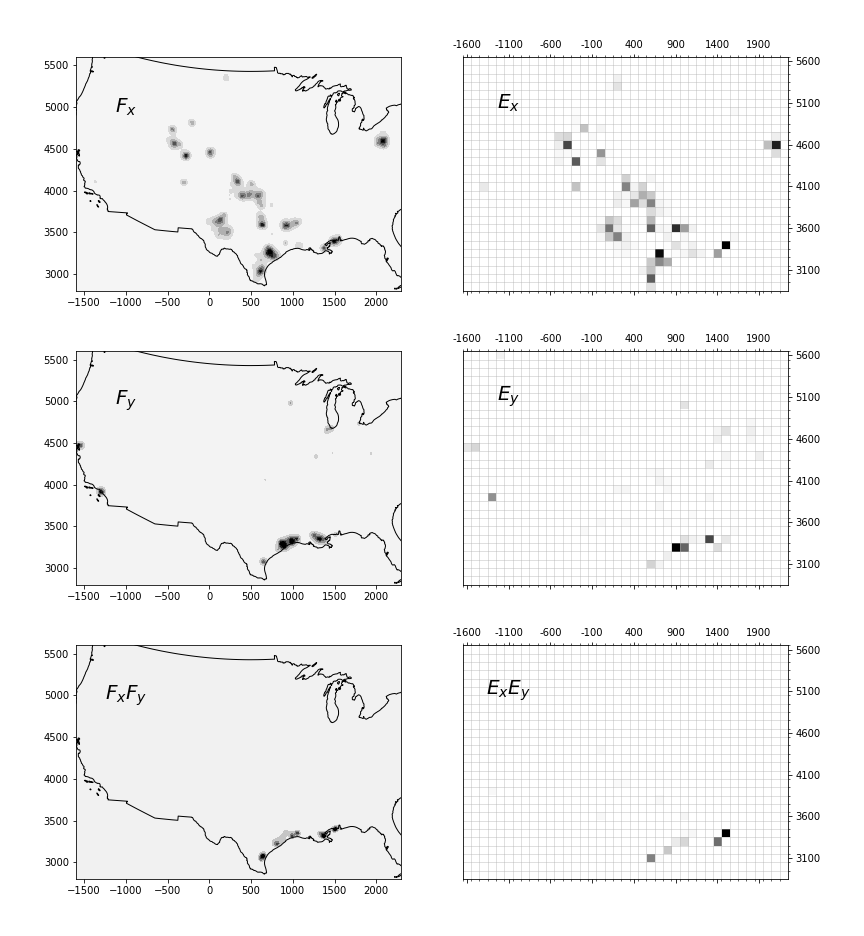

**In this section, we explore the conditions under which measures of coexistence in continuous space align with outcomes of cooccurrence in administrative areas.** We also provide tools to evaluate the caveats in using discrete areal data for cooccurrence, often referred to as the 'Modifiable Area Unit Problem' (MAUP). This argument, as discussed by Duranton, suggests avoiding certain indices like that of Ellison. Instead, we aim to identify conditions where continuous and discrete coexistence indices agree.

Works in spatial analysis have repeatedly highlighted issues when using administrative districts as the basic unit of analysis. These areas can vary significantly in surface area, population, or economic relevance. They may have irregular shapes, and the distances separating each pair of districts might not be acknowledged in some analyses.

To systematically study these potential issues, let's introduce a model of continuous space. Assume any establishment has an influence around it, which is a function of distance to the establishment location. This influence is formalized as a probability density function. An industry is described by the collection of facilities that belong to it. Thus, the influence of an industry in continuous space is the sum of probability density functions describing all plant locations:

$$
F_{x}(\textbf{x}) = \sum\limits_{i}^{N_x} f_{x, i}(\textbf{x})
$$

- **$x$**: Refers to industry $x$
- **$\textbf{x}$**: Position in a 2D plane
- **$i$**: Each plant belonging to industry $x$
- **$N_x$**: Total number of plants in industry $x$

*Figure: Demonstration of setup for continuous space (left) versus areal data (right) comparison. Top plots relate to locations of natural gas extraction fields (industry $x$). Middle plots relate to locations of oil refineries. Lower plots are the result of multiplying the upper plots. Grid lines depict artificial square areas of 100km width. Map projection is UTM 14S, but results are robust to certain deformation introduced by the projection. In these particular plots, the probability function of the point locations has width $b = 100km$. Lower left are products of density functions, and the lower right are cooccurrence measures.*

If taken as probability distributions, the joint probability that two industries influence a place $\textbf{x}$ is given by the product of probabilities: $F_x(\textbf{x})\ F_y(\textbf{x})$.

For a graphical representation of such $F_x(\textbf{x})$, $F_y(\textbf{x})$, and $F_x(\textbf{x})\ F_y(\textbf{x})$, see the left side of the figure above. To sum up all places across the country influenced by both industries $x$ and $y$, we compute the integral:

$$
\iint\limits_{R} F_{x} F_{y} dR
$$

where **$R$** represents the whole area of integration (the whole country).