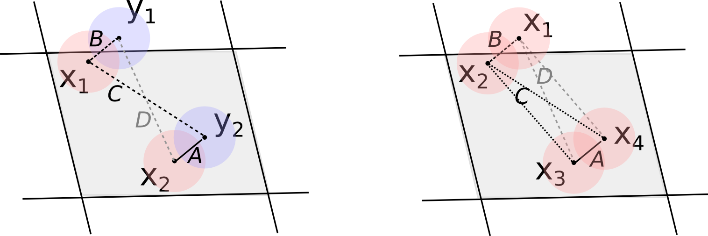

**Cosine Similarity Between Industries**

A cosine similarity between a pair of industries is a **normalized dot product**. The dot product of the vector of areal employment for industry $x$ and industry $y$ is the $x$-th, $y$-th element of the matrix $M = E^{T} E$ where $E$ is the matrix (data) of employment by area. This is given by:

$$
M_{x, y} = \sum\limits_{a} E_{x,a} . E_{y,a} = \sum\limits_{a} \left( \sum\limits_{i=1}^{N_{x,a}} E_{xi} \sum\limits_{j=1}^{N_{y,a}} E_{yj} \right) = \sum\limits_{a} \sum_{\mathclap{\substack{i \in x,a \\ j \in y,a}}} E_{xi} E_{yj}
$$

For a graphical representation of $E_{x,a}$, $E_{y,a}$, and their product, see the right side of **Figure 1**. The lower plots show the product of employment levels, with the grid demarcating the modeled areas $a$. The exercise in this section is to compare a normalized volume under the $\mathbb{R}^2 \rightarrow \mathbb{R}$ function in the lower left plot to the normalized area-based product in the lower right plot.

**Comparing Dot Products and Density Functions**

Can the dot product between two industries expressed in their areal values be compared to the overlap of their density functions? Expressed from the density functions of individual plants, this is:

$$
\iint\limits_{R} F_{x} F_{y} \, dR = \iint\limits_{R} \left( \sum\limits_{i}^{N_x} f_{x, i}(\textbf{x}) \sum\limits_{j}^{N_y} f_{y, j}(\textbf{x}) \right) \, dR
$$

This sum will potentially consist of $N_x \cdot N_y$ terms, as the density function around each location can have a non-negative overlap with all other locations. Distributing the product of these sums and because of the additivity of integrals:

$$
\sum_{\mathclap{\substack{i \in x \\ j \in y}}} \left( \iint\limits_{R} f_{x, i}(\textbf{x}) f_{y, j}(\textbf{x}) \, dR \right) = \sum\limits_{a} \sum_{\mathclap{\substack{i \in x,a \\ j \in y}}} \left( \iint\limits_{R} f_{x, i}(\textbf{x}) f_{y, j}(\textbf{x}) \, dR \right)
$$

This can be separated into sums for each area, where the terms involving a firm $x_i$ in area $a$ are assigned to such area.

**Comparing Areal Terms**

Now let us compare the contribution of the areal terms, both in the discrete and in the continuous case. We aim to establish a relation of the type:

$$
\sum_{\mathclap{\substack{i \in x,a \\ j \in y}}} \left( \iint\limits_{R} f_{x, i}(\textbf{x}) f_{y, j}(\textbf{x}) \, dR \right) \sim \sum_{\mathclap{\substack{i \in x,a \\ j \in y,a}}} E_{xi} E_{yj}
$$

For managing this, we will distinguish four possible situations that apply to each of these pairs of $x$, $y$ locations:

- **A**: The pair overlaps and shares the area.
- **B**: The pair overlaps while belonging to different areas.
- **C**: The pair does not overlap, but they belong to the same area.
- **D**: The pair does not overlap and they belong to different areas.

This is illustrated schematically in **Figure 2**.

**Analyzing Pairwise Relations**

Splitting the pairwise relations like this allows us to relate the individual terms of pairs when they fall in condition A, letting us move a step further. The cases in B and C introduce differences between the continuous and discrete accounts. These are the situations sometimes raised in criticism of the use of areal data and in the discussion of the MAUP problem. Namely, points can be close to each other and lie in different areas, and points can lie in the same area while being far from each other in practice. Separating these terms allows us to find out in which cases they will become small enough for the terms in A to dominate the relation. The pairs in D contribute to the agreement between the continuous and discrete accounts.

Expressing the relation split according to these cases, we have:

$$
\text{LHS} = \sum\limits_{i, j \in A} \iint\limits_{R} f_{x, i}(\textbf{x}) f_{y, j}(\textbf{x}) \, dR + \sum\limits_{i, j \in B} \iint\limits_{R} f_{x, i}(\textbf{x}) f_{y, j}(\textbf{x}) \, dR
$$

$$
\text{RHS} = \sum\limits_{i, j \in A} E_{xi} E_{yj} + \sum\limits_{i, j \in C} E_{xi} E_{yj}
$$

These expressions will match each other if the terms in the first sum match for each $i,j$ and the sums over cases B and C are relatively small.

For the terms from pairs in C to not dominate those in A, we need areas to not be much larger than the radius of influence of a location. For the pairs in B to not dominate those in A, we need that locations from a given area do not overlap with locations from neighboring areas, which will be the case if the radius of influence is not much larger than the area itself. Therefore, these differences between the discrete and the continuous account will be relatively smaller if the area of influence we model around the locations is about the size of the typical administrative area, not much smaller, not much larger.

As for the terms in A, the sums will be equal if each of the terms in them are equal. That is, we ask that:

$$
E_{xi} E_{yj} = \iint\limits_{R} f_{x, i}(\textbf{x}) f_{y, j}(\textbf{x}) \, dR;\ \forall i, j \in A
$$

**Conclusion**

Understanding these conditions helps in determining when the discrete and continuous models align, thus providing insights into the effective use of areal data in industry analysis.