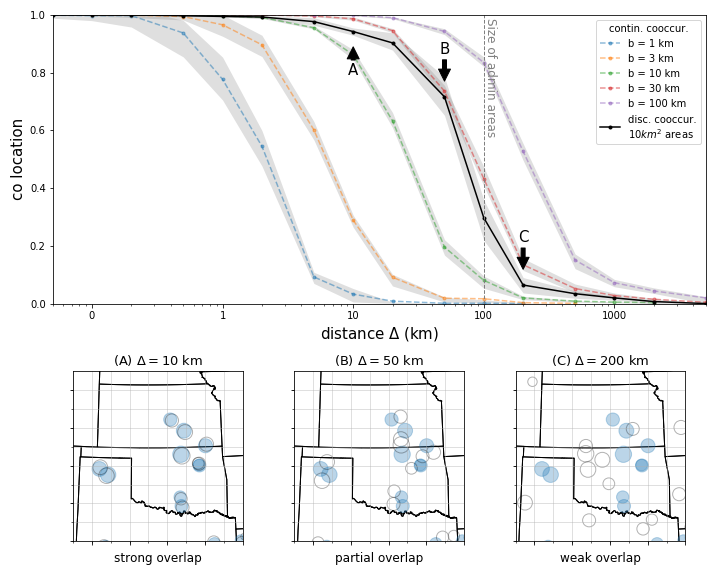
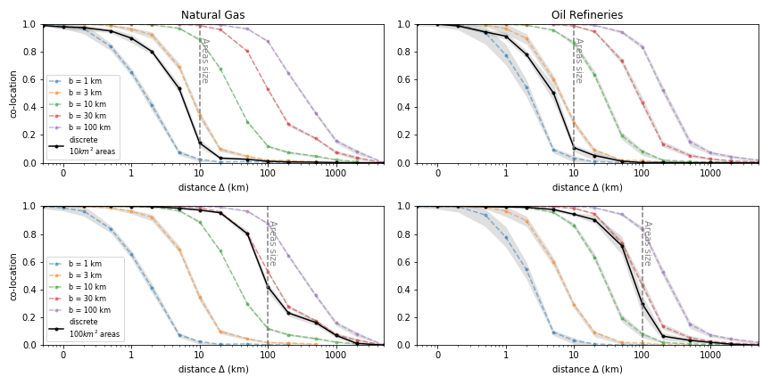

**Understanding the Decay of Coexistence Measures with Distance**

The following analysis explores how coexistence measures decay with distance $\Delta$. This is depicted in the figure below.

- **Top Plot**: Shows the decay of coexistence measures with distance $\Delta$. The black line represents cosine similarity on administrative areas, while the colored lines show the overlap of density functions in continuous space. These density functions are modeled as radial exponential decay, computed for various width parameters as indicated in the legend. 
  - At the left end ($\Delta \rightarrow 0$), there is full overlap, and coexistence is near 1.
  - At the right end ($\Delta \gg 1$), there is no overlap, and coexistence is near zero.
  - The transition between these extremes is significant. Discrete coexistence matches the continuous account only when the width $b$ of establishment density functions is slightly less than $\hat b = 30$ km. The dashed vertical line indicates the area size.

- **Bottom Plot**: Displays maps with circles around establishment locations (in blue) and $\Delta$ shifted locations for three values: $\Delta = 10$ km, $50$ km, and $200$ km, denoted as $A, B, C$ on the upper plot.

The outcome of this experiment, illustrated in the figure, is applied to the location of oil refineries within $(100 \text{ km})^2$ square areas. Generalizations of this experiment, applied to natural gas extraction locations and repeated for $(10 \text{ km})^2$ areas, are shown in the next figure.

**Exploring the Role of Area Sizes**

This exercise tests the decay of coexistence as we transition from a full coexistence situation (co-location of establishments with themselves) to a zero coexistence situation. The parameter $b$, describing the influence of establishments, governs the onset of decay in continuous space. Interestingly, the discrete account, where cosine similarity of total employment by areas is computed as a measure of similarity, also presents a decay of similar shape.

As the decay of coexistence in continuous space shifts with increasing $b$, there exists an intermediate $b$ where continuous and discrete accounts align. Computational exercises suggest that continuous and discrete accounts match best if $b \approx 0.3d$, where $d$ denotes area size.

On average, US counties are $\sim 160 \text{ km}^2$ in size. A square county of this area is approximately $40$ km wide. Simulations indicate that using cosine similarity as a co-occurrence measure for employment by county assumes an influence of establishments decaying radially with a parameter $b \approx 13$ km.

In previous sections, we noted that a family of discrete coexistence measures are partially equivalent. These developments help us understand the concrete meaning of coexistence measures when applied to US county data.

**Figure Analysis**

In the figure above, we replicate the decay test for two area sizes and two different industries. The results are largely consistent across both industries tested. Additionally, the decay of area-based measures is directly related to the size of the areas. Larger areas imply considering coexistence at a larger distance, as the relative position of the black curve and the vertical gray line remains consistent when changing area size.