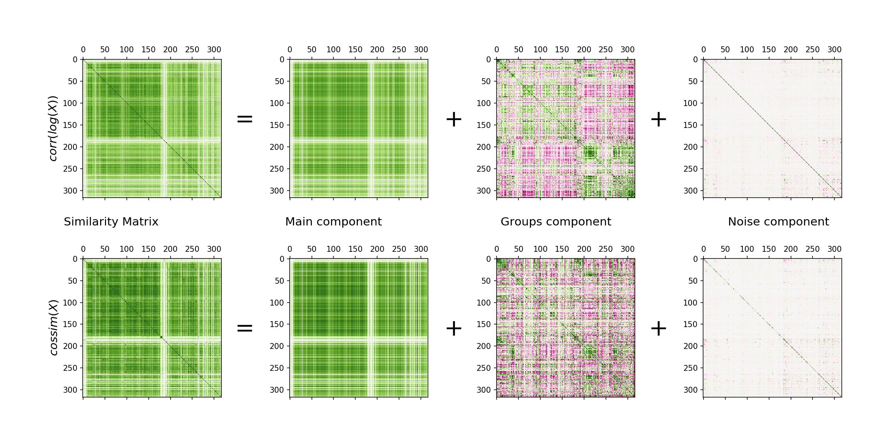

## Methods for Analyzing Correlation Matrices

In this section, we explore techniques specifically adapted for processing similarity matrices, focusing on correlation matrices.

### Eigenvalue Decomposition

Correlation matrices often exhibit a single large eigenvalue linked to the main mode, with subsequent smaller eigenvalues indicating non-random structures. The majority of eigenvalues align with those of a random matrix. A correlation matrix $C_{(p \times p)}$, being real symmetric, can be decomposed as:

$$
C = \sum_k \lambda_k u_k u_k^T = \sum_k \lambda_k V_k
$$

where $\lambda_k, u_k$ denote the $k$-th eigenvalue and eigenvector, and $V_k \in \mathbb{R}^{p \times p}$. This decomposition is useful for 'cleaning out' the correlated background and identifying associations between industries.

### Application to Cosine Similarity and Correlation of Logs

The decomposition works similarly for cosine similarity and correlation of logs matrices. **Figure 1** illustrates this graphically, showing how removing the main component reveals an underlying group structure. Further components contain only small fluctuations.

### Principal Component Analysis (PCA)

Correlation matrices can be processed similarly to PCA. First, center the dataset by subtracting industry means, denoted as $X$. The covariance matrix $C = X^{T}X/(n-1)$ is diagonalized to find principal components. This involves looking at eigenvectors of the largest eigenvalues.

### Complementary Techniques

The proposed method expresses the similarity matrix as a sum of a first eigenvector component and subsequent eigenvector groups, as in Plerou et al. (1999). This contrasts with PCA, which focuses on principal components. Both techniques are complementary, and further study of their connections could be insightful.

### Community Detection and Clustering

Using the Scikit Learn spectral clustering algorithm, we identify 'cores' of communities by repeating the fitting with different random seeds. This helps in finding strongly similar groups and weeding out weakly linked activities.

### Exploring Economic Geography

We apply Pearson correlation of logs and cosine similarity to employment levels and the number of establishments, resulting in four criteria: 

- **A** - corr(log(X = no. establishments))
- **B** - cos(X = no. establishments)
- **C** - corr(log(X = employment))
- **D** - cos(X = employment)

The community detection process is applied to each, ensuring robustness across different measures of economic activity.

### Summary of Processing Steps

To conclude, the processing steps for results in **Section: Results and Clusters** include:

- Averaging yearly values from 2002-2007, stored as a table $X$ of shape (3272, 320).
- Computing cosine similarity and Pearson correlation of log values.
- Decomposing similarity matrices by eigenvalues to study non-random group structures.
- Applying spectral clustering to detect geographic patterns and discuss outcomes.