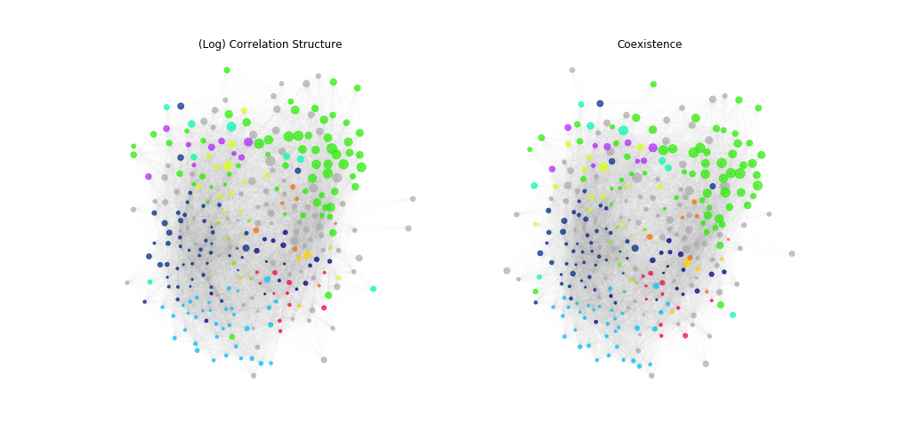
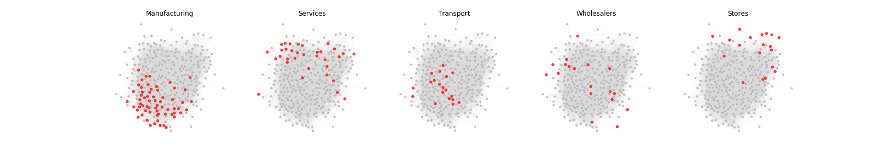
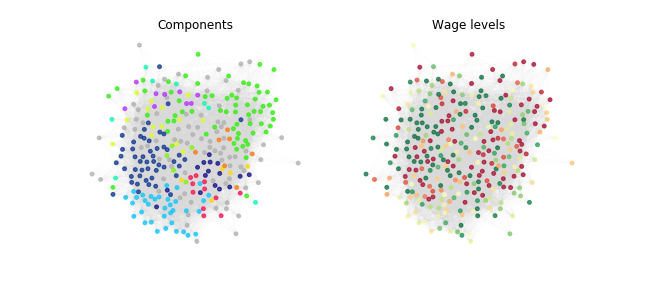

## Results: Network of Industries

Let us begin by presenting the **network structure of industries**. This section explores the outcome by examining the network plots of industries as shown in **Figure 1**. Each node represents a NAICS 4-digit industry. The plot on the left is derived from the correlation of log levels, while the one on the right uses cosine similarity. 

Given that the results are largely analogous when switching between the number of establishments or employment levels, the groups component of the similarity matrices was extracted. The similarity computed from each of these variables was averaged to create a single network plot.

### Community Detection

Following the community detection methods detailed in *Section: Matrices*, 11 components were detected. These components are represented by different colors in the networks of **Figure 1** and are listed in **Table 1**.

*Figure 1: Networks of industries. Left: from groups component of correlation of log levels. Right: from groups component of cosine similarity. Edge weights computed from employment levels and number of establishments are averaged for each plot.*

An interactive version of this plot is available online, allowing for further exploration of the network.

### Highlighting Industry Titles

To gain further intuition into the regions of the plotted network, **Figure 2** highlights some of the most common words in industry titles, such as *manufacturing, services, transport, wholesalers,* and *stores*. This uses the coexistence network, although similar results are obtained with the correlation structure.

*Figure 2: Network of industries. Highlight of frequent words in industry titles.*

### Wage Levels in the Network

Finally, **Figure 3** illustrates nodes colored according to wage levels. Although not clearly distinguishable in the plot, certain components of the network are characterized by higher than average wage levels. These components are related to urban activities and include NAICS categories such as 51 Information, 52 Finance and insurance, 53 Real estate and rental and leasing, and 54 Professional and technical services.

*Figure 3: Network of industries. Clusters by community detection (left) and wage levels (right). Only clusters of urban activities are characterized by a higher average wage level.*

This analysis provides a comprehensive view of the network structure of industries, highlighting the importance of community detection and wage level differentiation.