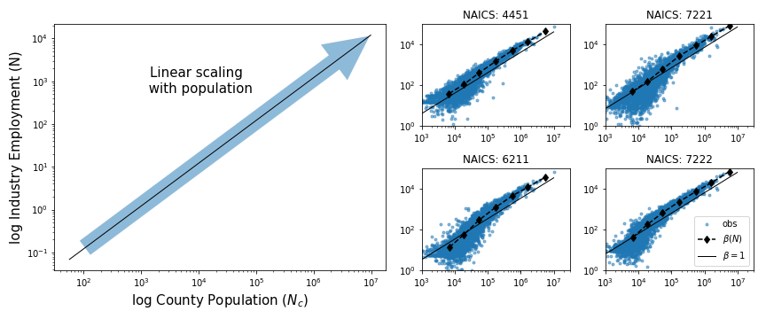
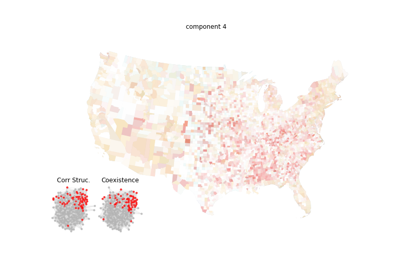
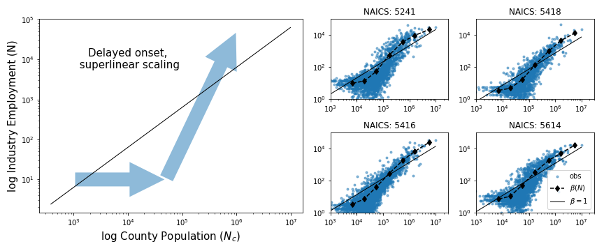

### Population

The activities in this theme closely match the **distribution of population**. Although these activities may not follow it exactly, the distribution serves as a reference for many accounting considerations, making its acknowledgment both useful and justified.

**Key Activities**:
- **Retail shops** and **personal services** such as restaurants fall into this category, representing consumer goods. 
- These businesses rely heavily on proximity to customers, making demand a decisive factor for location (Berman, 2010; Runyan, 2008). 
- For instance, Fujita (1999) distinguishes between industries producing for broader markets and those like restaurants and supermarkets that sell locally.

Porter (1980) also highlights the connection between demand dependence and population intensity, noting that demographic changes significantly influence the buyer pool size and demand growth rate. The potential customer group may vary based on age, income, education, or geographic location.

**Table: Non-tradables**  
Non-tradables include stores and personal services. The table below lists activities and their distribution:

| Distribution | Activities |
|--------------|------------|
|  | **NAICS Codes**: 238 (Construction contractors), 44-45 (Retail trade), 53 (Real estate and rental and leasing), 54 (Professional and technical services), 62 (Health care and social assistance), 72 (Accommodation and food services), 81 (Other services, except public administration) |

**[Interactive Map Link](https://api.mapbox.com/styles/v1/matuteiglesias/ck15kzlp62oc41dmraqz0vtw8.html?fresh=true&title=true&access_token=pk.eyJ1IjoibWF0dXRlaWdsZXNpYXMiLCJhIjoiY2ptdGN1bjViMDY4MzNxcDEyMXQ4ejU4bCJ9.wOgfXtbyetTot1CZN8D6Hg)**

### Cities

Cities are a **notorious singular feature** of our society, often discussed for their unique characteristics. Scaling is a promising tool for quantifying externalities related to city size.

**Activities in the 'Cities' Theme**:
- **NAICS Codes**: 5112 (Software publishers), 5418 (Advertising), 5161 (Internet publishing and broadcasting), 5416 (Management and technical consulting services), 4251 (Electronic markets and agents and brokers), 5415 (Computer systems design), 5616 (Investigation and security services), 5614 (Business support services), 5414 (Specialized design services), 5511 (Management of companies and enterprises).

These activities exhibit distinct scaling features, differentiating them from the 'population' theme. While a detailed discussion of formal and conceptual approaches to cities is beyond this paper's scope, we briefly mention relevant literature.

**Scaling Patterns**:
- **Population Theme**: Activities proportional to population appear on the diagonal line.
- **Cities Theme**: Activities are less represented in small towns but become more prominent in larger cities, showing superlinear scaling.

**Complex Activities**:
- Activities in the 'cities' theme are considered **complex**, often emerging in large cities near the technological frontier. This aligns with the framework of scaling (Bettencourt, 2007), suggesting scale advantages in larger cities.

**Literature Insights**:
- Cities show higher productivity and educational attainment. Jacobs (1970) argues that innovations near the technological frontier often originate in large cities.
- Recent studies explore the development of knowledge-intensive, complex activities (Boschma, 2014; Balland, 2015, 2020).

These insights provide a foundation for understanding the complex dynamics of population distribution and city scaling.