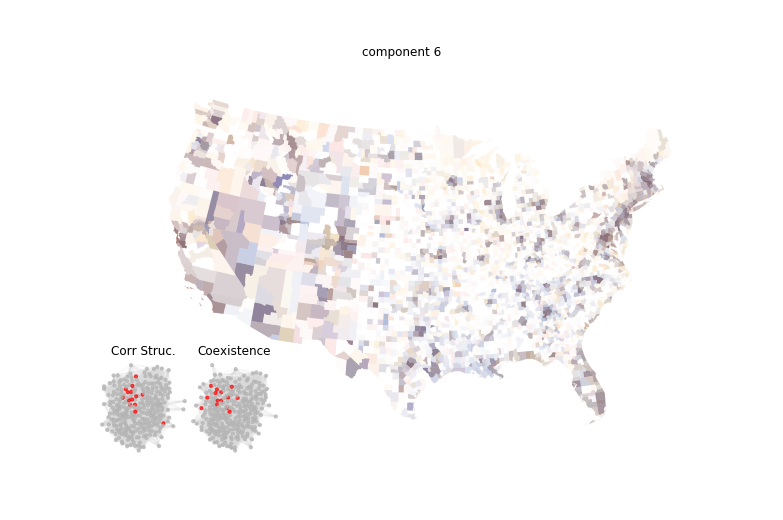
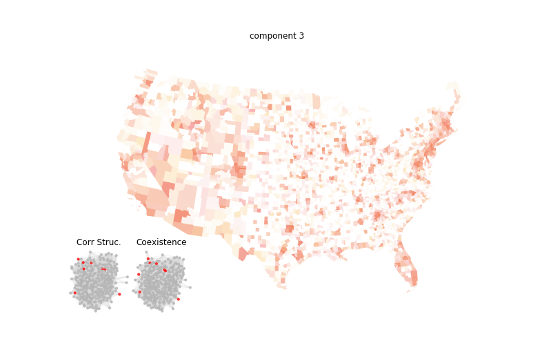
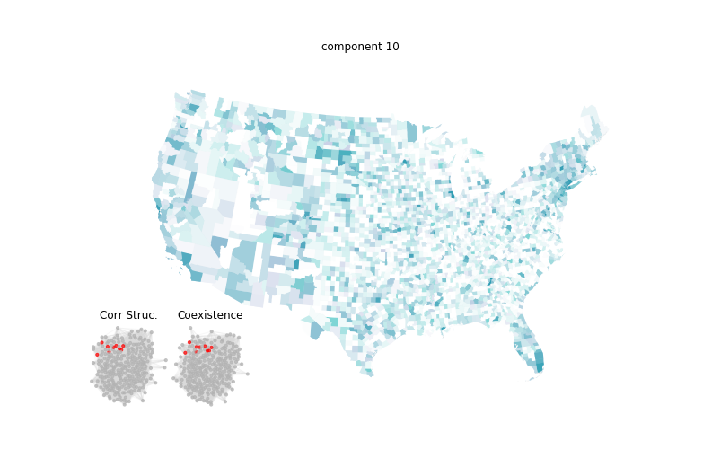

**Large City Economies: An Overview**

This section provides a detailed examination of the economic activities prevalent in large cities. The focus is on various sectors, including software publishing, finance, and other high-wage activities. Below are the tables summarizing these distributions and activities.

### Large City Economies I

- **Activities:**
  - **NAICS 5112**: Software publishers
  - **NAICS 5181**: ISPs and web search portals
  - **NAICS 5182**: Data processing, hosting, and related services
  - **NAICS 5415**: Computer systems design and related services
  - **NAICS 5417**: Scientific research and development services
  - **NAICS 5612**: Facilities support services
  - **NAICS 5619**: Other support services
  - **NAICS 6114**: Business, computer, and management training

For an interactive exploration, visit the [LINK TO INTERACTIVE MAP](https://api.mapbox.com/styles/v1/matuteiglesias/ck15ixwiv04rh1cl8s82f8aa3.html?fresh=true&title=true&access_token=pk.eyJ1IjoibWF0dXRlaWdsZXNpYXMiLCJhIjoiY2ptdGN1bjViMDY4MzNxcDEyMXQ4ejU4bCJ9.wOgfXtbyetTot1CZN8D6Hg).

### Large City Economies II

- **Activities:**
  - **NAICS 51**: Information
  - **NAICS 52**: Finance and insurance
  - **NAICS 53**: Real estate and rental and leasing
  - **NAICS 54**: Professional and technical services

Explore further with the [LINK TO INTERACTIVE MAP](https://api.mapbox.com/styles/v1/matuteiglesias/ck15ixwiv04rh1cl8s82f8aa3.html?fresh=true&title=true&access_token=pk.eyJ1IjoibWF0dXRlaWdsZXNpYXMiLCJhIjoiY2ptdGN1bjViMDY4MzNxcDEyMXQ4ejU4bCJ9.wOgfXtbyetTot1CZN8D6Hg).

### Other High Wage Activities

- **Activities:**
  - **NAICS 51**: Information
  - **NAICS 52**: Finance and insurance
  - **NAICS 53**: Real estate and rental and leasing
  - **NAICS 54**: Professional and technical services

For more details, access the [LINK TO INTERACTIVE MAP](https://api.mapbox.com/styles/v1/matuteiglesias/ck15ixwiv04rh1cl8s82f8aa3.html?fresh=true&title=true&access_token=pk.eyJ1IjoibWF0dXRlaWdsZXNpYXMiLCJhIjoiY2ptdGN1bjViMDY4MzNxcDEyMXQ4ejU4bCJ9.wOgfXtbyetTot1CZN8D6Hg).

---

These tables provide a snapshot of the economic landscape in large cities, highlighting key sectors and their contributions to urban economies.