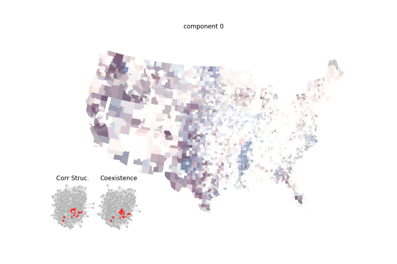
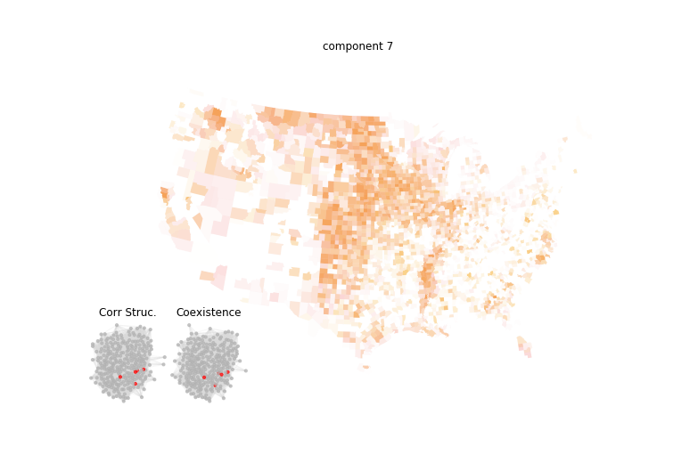
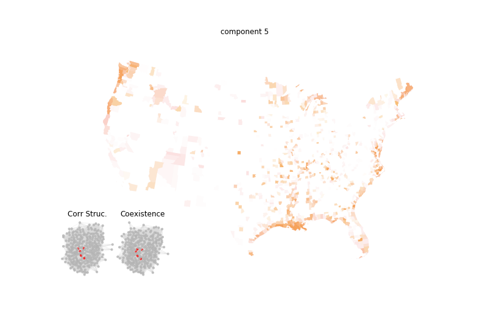
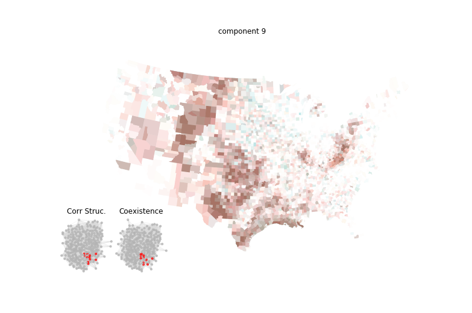
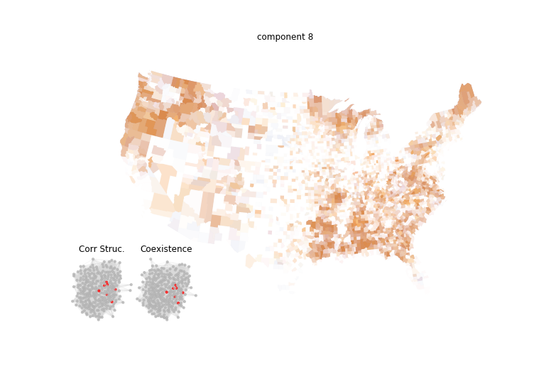

**Understanding Land Uses**

Natural advantages, such as the presence of natural inputs, differ spatially, and firms may choose locations to gain access to those inputs. This section explores activities that rely heavily on natural resources or are located near the upstream end of the supply chain to save on transport costs. We identify five components characterized by spatial patterns pointing to specific natural resources.

### Agriculture and Food I: Ranching

- **Distribution**: Grazing lands of Texas' west and fertile areas for crop and fruit production in Washington state and California's Central Valley.
- **Activities**:
  - NAICS 111: Crop production
  - NAICS 112: Animal production and aquaculture
  - NAICS 311: Food manufacturing

[Interactive Map](https://api.mapbox.com/styles/v1/matuteiglesias/ck15kzlp62oc41dmraqz0vtw8.html?fresh=true&title=true&access_token=pk.eyJ1IjoibWF0dXRlaWdsZXNpYXMiLCJhIjoiY2ptdGN1bjViMDY4MzNxcDEyMXQ4ejU4bCJ9.wOgfXtbyetTot1CZN8D6Hg)

### Agriculture and Food II: Corn Belt

- **Distribution**: Centered on the Midwest corn belt region and Mississippi Valley.
- **Activities**:
  - NAICS 1111: Oilseed and grain farming
  - NAICS 1122: Hog and pig farming
  - NAICS 311: Food manufacturing
  - NAICS 4245: Farm product raw material merch. wholesalers

[Interactive Map](https://api.mapbox.com/styles/v1/matuteiglesias/ck15kzlp62oc41dmraqz0vtw8.html?fresh=true&title=true&access_token=pk.eyJ1IjoibWF0dXRlaWdsZXNpYXMiLCJhIjoiY2ptdGN1bjViMDY4MzNxcDEyMXQ4ejU4bCJ9.wOgfXtbyetTot1CZN8D6Hg)

### Water Economy

This component includes fishing, tourism, and transportation activities in rivers, lakes, and coasts, highlighting the importance of natural resource endowments.

- **Activities**:
  - NAICS 1141: Fishing
  - NAICS 3117: Seafood product preparation and packaging
  - NAICS 3366: Ship and boat building
  - NAICS 4831: Sea, coastal, and great lakes transportation
  - NAICS 4832: Inland water transportation
  - NAICS 4872: Scenic and sightseeing transportation, water
  - NAICS 4883: Support activities for water transportation

### Fuels and Mining

This component focuses on oil, gas, and mineral extraction, and their downstream activities like petroleum and coal product manufacturing.

- **Activities**:
  - NAICS 21: Mining, quarrying, and oil and gas extraction
  - NAICS 324: Petroleum and coal products manufacturing
  - NAICS 3251: Basic chemical manufacturing
  - NAICS 486: Pipeline transportation

[Interactive Map](https://api.mapbox.com/styles/v1/matuteiglesias/ck15jh8m41ym81dpatv1xc35o.html?fresh=true&title=true&access_token=pk.eyJ1IjoibWF0dXRlaWdsZXNpYXMiLCJhIjoiY2ptdGN1bjViMDY4MzNxcDEyMXQ4ejU4bCJ9.wOgfXtbyetTot1CZN8D6Hg)

### Forests and Timber

This component aligns with the distribution of natural forests and includes primary stages of wood processing industries.

- **Activities**:
  - NAICS 1131: Timber tract operations
  - NAICS 1132: Forest nursery and gathering forest products
  - NAICS 1133: Logging
  - NAICS 1153: Support activities for forestry
  - NAICS 3211: Sawmills and wood preservation
  - NAICS 3212: Plywood and engineered wood product manufacturing
  - NAICS 3371: Household and institutional furniture manufacturing

[Interactive Map](https://api.mapbox.com/styles/v1/matuteiglesias/ck15krsak2umb1ckanne9lv54.html?fresh=true&title=true&access_token=pk.eyJ1IjoibWF0dXRlaWdsZXNpYXMiLCJhIjoiY2ptdGN1bjViMDY4MzNxcDEyMXQ4ejU4bCJ9.wOgfXtbyetTot1CZN8D6Hg)