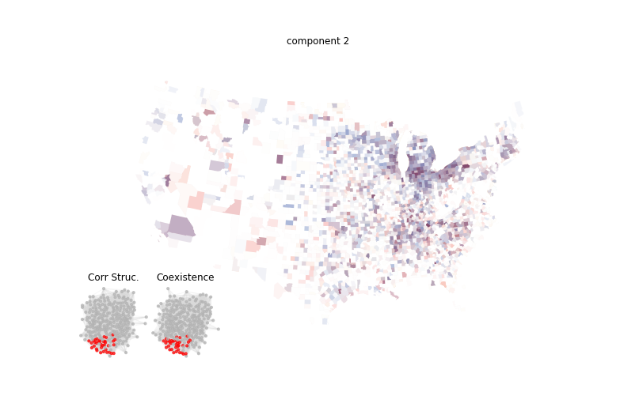
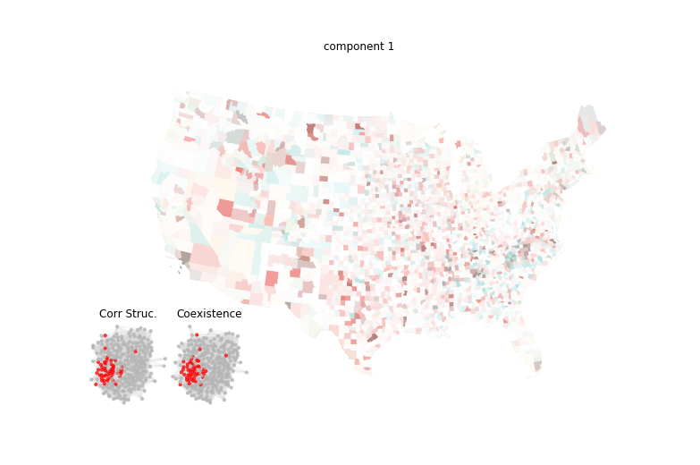

### Manufacturing

The fourth and last theme is **manufacturing**, encompassing activities in the NAICS categories 31 to 33. These activities are not clearly tied to population, natural resources, or cities. Instead, the location decisions of industrial establishments are influenced by various externalities, often built on historical paths of arbitrary or reasonable origin.

**Key Externalities:**

- **Transport Cost Externalities:** Availability of intermediate goods.
- **Labor Market Pooling:** Access to labor.
- **Specialized and Technical Knowledge:** Often referred to as 'ideas'.

These externalities have been extensively researched, with early work by Marshall (1890) and further developments by McCann (2008), Beaudry (2009), and de Groot (2016). Each mechanism is qualitatively different and may combine uniquely to determine specific plant location choices over time. Recent studies by Ellison (2010) and Diodato (2018) have focused on these heterogeneities.

**Industry Sectors:**

The main industry sectors identified are linked to the **steel value chain**, including the automotive and autoparts industry and their suppliers. This example illustrates most of the mentioned externality channels across a network of thousands of heterogeneous businesses located throughout the US, with higher density in the Midwest region south of the Great Lakes.

Other sectors, such as the **textile industry**, have developed in regional clusters. North Carolina, for example, has the largest textile mill industry and is the leading US state in textile exports. This industry, existing for over a century in the region, exemplifies path dependency in economic development and highlights the role of industry-related tacit knowledge and externalities in cluster formation.

**Tables:**

| Distribution | Activities |
|--------------|------------|
|  | NAICS 325 Chemical manufacturing NAICS 326 Plastics and rubber products manufacturing NAICS 327 Nonmetallic mineral product manufacturing NAICS 331 Primary metal manufacturing NAICS 332 Fabricated metal product manufacturing NAICS 333 Machinery manufacturing NAICS 335 Electrical equipment and appliance mfg. NAICS 336 Transportation equipment manufacturing |

**Interactive Map:** [LINK TO INTERACTIVE MAP](https://api.mapbox.com/styles/v1/matuteiglesias/ck15m189a00ig1cqdj919wdck.html?fresh=true&title=true&access_token=pk.eyJ1IjoibWF0dXRlaWdsZXNpYXMiLCJhIjoiY2ptdGN1bjViMDY4MzNxcDEyMXQ4ejU4bCJ9.wOgfXtbyetTot1CZN8D6Hg)

| Distribution | Activities |
|--------------|------------|
|  | NAICS 31-33 Manufacturing NAICS 48 Transportation NAICS 51 Information NAICS 52 Finance and insurance |

**Interactive Map:** [LINK TO INTERACTIVE MAP](https://api.mapbox.com/styles/v1/matuteiglesias/ck15m189a00ig1cqdj919wdck.html?fresh=true&title=true&access_token=pk.eyJ1IjoibWF0dXRlaWdsZXNpYXMiLCJhIjoiY2ptdGN1bjViMDY4MzNxcDEyMXQ4ejU4bCJ9.wOgfXtbyetTot1CZN8D6Hg)

By understanding these factors, we can better comprehend the spatial distribution of manufacturing activities and their historical and economic underpinnings.