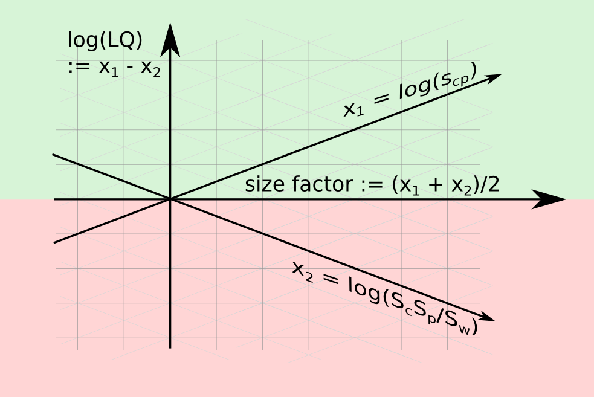
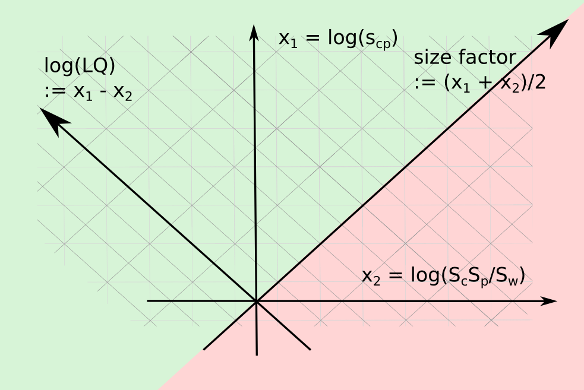

## A Convenient Framework for Working with Location Quotient Values

In this section, we introduce useful variables for describing any observed location quotient value. We will then discuss the empirical distribution of observations in three examples: exports by country and product, patent applications by region and technology class, and business counts by city and industry.

### The 2D Space for Log Location Quotients

Location quotients are defined as:

$$
LQ_{cp} = \frac{s_{cp} / S_c}{S_p / S_W} = \frac{s_{cp} / S_p}{S_c / S_W}
$$

where $s_{cp}$ is the value associated with categories $c$, $p$. The terms $S_c = \sum_p s_{cp}$, $S_p = \sum_c s_{cp}$, and $S_W = \sum_{cp} s_{cp}$ represent the sizes of entities $c$, $p$, and the table total, respectively. This shows that $LQ$ is the ratio between the relative size of element $s_{cp}$ on column $p$ and the relative size of row $c$ in the matrix total.

When $LQ_{cp} = 1$, we have:

$$
\frac{\hat s_{cp}}{S_W} = \frac{S_c}{S_W} \frac{S_p}{S_W}; \hspace{1cm} \text{if}\ \hat{LQ}_{cp} = 1    
$$

Many studies classify observations by whether they are above or below the $LQ = 1$ threshold, transforming LQ levels into a binary variable $LQ > 1$.

The terms in the definition can be rearranged as:

$$
LQ_{cp} = s_{cp} / \left(\frac{S_c S_p}{S_W}\right)
$$

Taking the logarithm of this definition converts the ratio to a difference:

$$
\begin{split}
\log(LQ_{cp}) &= \log(s_{cp}) - \log\left( {S_c S_p}/{S_W} \right)\\
\log(LQ_{cp}) &= \log(s_{cp}) - \left[ \log(S_p) + \log(S_c) - \log(S_W) \right]\\
y_1 &= x_1 - x_2
\end{split}
$$

Here, $y_1 := \log(LQ_{cp})$ is determined by two magnitudes: $x_1 := \log(s_{cp})$ (observation) and $x_2 := \log\left( {S_c S_p}/{S_W} \right)$ (uncorrelated margins expectation).

The definition of $LQ$ can be seen as a constraint involving three unknowns, lying on a two-dimensional plane. A location quotient observation is fully determined if we have two of the following: $y_1 = \log(LQ)$, $x_1 = \log(s_{cp})$, or $x_2 = \log\left( {S_c S_p}/{S_W} \right)$.

Another convenient variable is $y_2 := (x_1 + x_2) / 2$, the mean between the log observed value $x_1 = \log(s_{cp})$ and the log independent margins expectation $x_2$. This is called the **size factor**. While the location quotient captures the difference between $x_1$ and $x_2$, the size factor captures the value around which these are situated.

Any pair in $x_1$, $x_2$, $y_1$, $y_2$ is enough to define an LQ observation. These variables are linearly independent among themselves. LQ and size factor capture the asymmetric and symmetric parts of the relation between the observation $x_1$ and the expectation $x_2$. At the threshold $LQ = 1$, the size factor $y_2$ matches the value that the observation and the expectation ($x_1$, $x_2$) are taking.

We can describe an LQ observation using any pair of variables. In this paper, both coordinates ($y_1$, $y_2$) and ($x_1$, $x_2$) are used. In the first case, $LQ > 1$ values are in the (green) upper hemisphere. In the second case, $LQ > 1$ appear in the (green) hemisphere above the identity line, where $x_1 > x_2$.

This framework is useful for modeling jumps of $LQ$ over a threshold and dealing formally with issues involving location quotients. It helps analyze sparseness in the data, focusing on entity sizes ($S_c$, $S_p$, $S_w$) reflected in $x_2$. The framework can be generalized to separate entity sizes: $x_2 = \log(S_c) + \log(S_p) - \log(S_w) = x_c + x_p - x_w$. It complements discussions on location quotients with entity sizes and absolute levels $x_1$, as seen in works by Kemeny and Fracasso.

In summary, this framework is robust and convenient for formalizing questions involving location quotients.