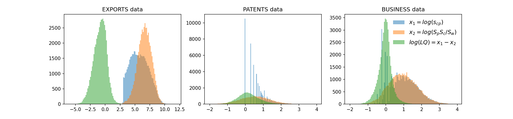
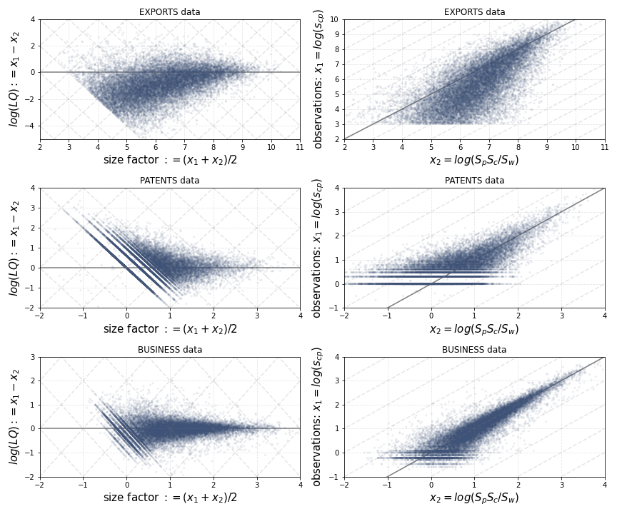

## Empirical Distributions

The distribution of values $x_1 = \log(s_{cp})$ significantly influences the distribution of row and column sums, and consequently affects $x_2 = \log(S_c S_p / S_w)$. More specifically, a bell-shaped distribution of the log values $x_1 = \log(s_{cp})$ results in a bell-shaped distribution of $\log(S_c)$ and $\log(S_p)$ values, and thus $x_2$ values. This leads to a bell-shaped distribution of $\log(LQ) = x_1 - x_2$ values.

We confirm this intuition with empirical data. The distributions of $x_1$, $x_2$, and $\log(LQ) = x_1 - x_2$ are illustrated in **Figure 1**.

**Figure 1**: Distribution of $x_1 = \log(s_{cp})$, $x_2 = \log(S_c S_p / S_w)$, and $\log(LQ) = x_1 - x_2$. The cut at $\log(s) = 3$ reveals the lower bound in $s_{cp} = 1000$ US\$ in our exports data. These distributions of log variables are much 'better behaved' than those of linear LQ, $s_{cp}$, or $S_c S_p / S_w$. The distribution of the number of patents and business counts is largely constrained to natural numbers, frequently showing small values. This feature explains the fragmented appearance of its histogram and scatter plots in **Figure 2**.

**Figure 2**: Distributions of observed points in log scale. The dots represent actual data points in our dataset. Plots on the top are for trade data, middle for patent counts data, bottom for business counts data. Left: points in ($(x_1 + x_2) / 2, \log(LQ) = x_1 - x_2$) coordinates. Right: points in ($x_2, x_1$) coordinates, with $x_1 = \log(s_{cp})$ and $x_2 = \log(S_c S_p/S_w)$. Left plots can be transformed to right plots by applying a linear transformation. Dark lines indicate axes $\log(LQ)$, $x_1$, $x_2$. A log transformation lets all observations form a bounded cloud.

### Discussion on Empirical Settings

In the context of patent data, even with fractional counting, small natural numbers are quite frequent. A similar pattern is observed with business counts data, as shown in the middle and right plots of **Figure 1**. Despite the fragmented nature of the distribution of raw values, the rows, column sums, and the $x_2$ factor are well-distributed in logs, mitigating potential issues.

For exports data, there are additional features to consider. A lower bound of $10^3$ US\$ is evident in our data (sharp edge on the distribution of values, left plot in **Figure 1**). This primarily affects the lower end of log-distributed values, and is not expected to critically impact row and column sums.

### Handling Null Values

When applying a logarithmic transformation, null values can pose challenges depending on the task. In export data, null values might represent small values like US\$ 500, or indicate absent activities in a region. For decisions regarding the $LQ > 1$ condition, null values should be considered below the $LQ = 1$ threshold.

In regression analyses using LQ values, addressing null values requires careful consideration due to potential distortions. Options include replacing zero values with a "very small" value, omitting null observations, or using an interaction with a dummy variable for null values. The choice depends on the specific application context.

### Conceptual Interpretation of Null Entries

Null entries in cross sections often indicate either small volumes (as in truncated export data) or absences. Absences can be mild, such as intermittent exports, or deep, resulting from sparse records in detailed cross sections. Researchers must decide how to handle these null entries based on their specific tasks. However, the presence of null entries should not necessarily deter the application of log transformations on raw data.

This paper focuses on the $LQ = 1$ threshold and observations fluctuating around it, ensuring that the undefined nature of the log of null values does not hinder our analyses.

---

**Footnote**: Fractional counting allows values to exist between natural numbers and below one.