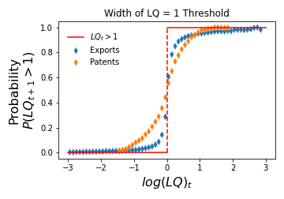

## The Probabilistic Location Quotient

In this section, we introduce the concept of a **probabilistic location quotient** (pLQ). This metric is defined as the probability that $LQ_{t+1} > 1$, given the situation at time $t$, which is described by a point in a two-dimensional space.

### Understanding pLQ

The probabilistic location quotient represents the likelihood that $LQ_{cp} > 1$ at time $t+1$, conditional on the coordinates $x_1$, $x_2$ defining an observation at time $t$.

### Research Context

Many studies aim to understand the likelihood of a country-product or region-technology state having $LQ > 1$. Researchers explore whether factors exist that increase the chances of transitioning from $LQ < 1$ to $LQ > 1$, or vice versa. Notable works in this area include those by Hausmann, Boschma, and Neffke, among others.

The factors considered are often motivated by theory or specific research questions. The variable LQ, or its transformations such as $\log(LQ)$ or $LQ_t > 1$, is frequently included as a predictor. This inclusion is reasonable because if observations are relatively stable, $LQ_{t+1}$ is likely to be near $LQ_t$, and the condition $LQ > 1$ can be expected to persist over time.

### Key Insights

When $LQ_t$ is used as the sole variable to estimate the probability that $LQ_{t+1} > 1$, it confirms the intuition that being above or below the threshold $LQ = 1$ is significant. This is illustrated in **Figure 1**.

*Figure 1: The discrete variable $LQ > 1$ (red), and the probability that $P(\log(LQ_{t+1}) > 0 | \log(LQ)_t)$ (blue). Plotted as a function of $\log(LQ)_t$. In the extremes, both coincide, but near the threshold of $\log(LQ)_t \approx 0$, the latter provides a natural interpolation between the two values. Each dataset shows a certain transition width, suggesting that the scale of LQ is not unique for all datasets.*

### Interpretation and Implications

- **Probability Behavior**: At very low and very high $\log(LQ)$ values (left and right ends of the plot in **Figure 1**), the probability $P(\log(LQ_{t+1}) > 0 | \log(LQ)_t)$ approaches zero and one, respectively. It approaches 0.5 when $\log(LQ) \approx 0$.
  
- **Effective Distance**: This probability acts as an interpolation between the {0, 1} values, adding structure to the discrete threshold. It provides insight into the width of the transition from zero to one at $\log(LQ) = 0$.

Another interpretation of this interpolation is as an effective distance to the $LQ = 1$ threshold. This is a key point we emphasize. Typically, there is uncertainty about whether a value, such as $LQ = 0.8$, is sufficiently close to $LQ = 1$. This approach allows us to specify that such a value corresponds to an 18% chance of $LQ_{t+1} > 1$ in the dataset. We propose associating the chances of observing $LQ_{t+1} > 1$ given $LQ_t = 0.8$ with an effective length of the gap from 0.8 to 1.