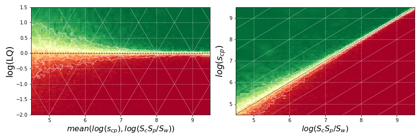
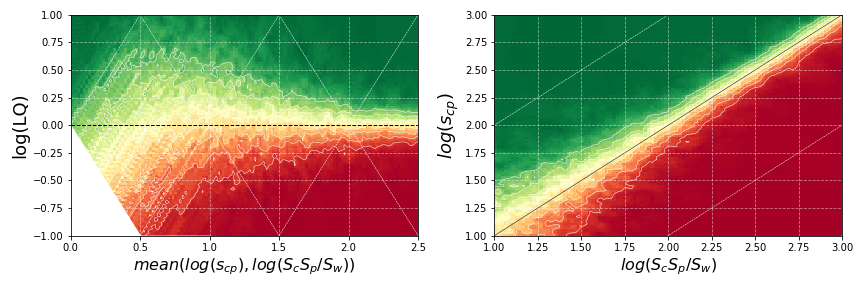

**Characterization of pLQ**

In this section, we delve into the main characteristics of the probability of Logarithmic Quotient (pLQ), focusing on its transition zones and how these transitions change with other variables, particularly in trade and patent data.

**Figure 1**: Plots of probability $pLQ = P(\log(LQ)_{cp, t+1} > 0 \mid \log(s_{cp}), \log(S_p S_c / S_W))$ as a function of $\log(S_p S_c / S_W)$ and $\log(LQ)$ (left) and $\log(s_{cp})$ and $\log(LQ)$ (right), computed on the trade dataset (top) and the patents dataset (bottom). These probability densities are computed using the k-nearest neighbor algorithm ($k = 200$) on a training set with at least a few hundred thousand observations of consecutive years. The red-yellow-green scale represents low-medium-high probabilities.

The condition $\log(LQ)_t > 0$ is the main determinant for whether $\log(LQ)_{t + 1} > 0$. However, the sizes of the observed values also play a significant role: the transition from $pLQ = 0$ to $pLQ = 1$ becomes narrower as the sizes of the involved observations increase. This varying transition width is the essence of size distortions in LQ that we aim to capture.

### Key Observations

1. **Transition Zones**: The space is split into two regions (red and green), largely corresponding to whether $LQ > 0$. The transition zone ($0 \rightarrow 1$) between these regions varies in width based on the sizes of the observations involved.

2. **Size Effects**: In the trade example, for countries and products with the same level of $LQ < 1$, smaller-sized entities have a higher chance of achieving $LQ > 1$ the following year. This analysis highlights how country-products (or region-technologies) with equal LQ but different sizes may face different situations regarding their potential to surpass the $LQ = 1$ threshold. This insight can guide decisions on how LQ values are not comparable across countries or products.

3. **Relevance of Size Effects**: From the trade dataset, an LQ of 0.5 ($\log(LQ) \approx -0.3$) for a product of average size implies more than a 15% chance of reaching $LQ > 1$ for small economies, a 5% chance for mid-sized countries, and between 1% and 2% for large economies.

### Implications

- **Level Curves of pLQ**: These curves serve as an a-posteriori estimation of starting points equally distant from the $LQ = 1$ threshold, offering a method to control size effects on the LQ metric. They can also be used as borders between categories, mapping observations to intervals of qualitative intensity that account for entities' sizes.

- **Revisiting Studies**: Studies using levels of $LQ \neq 1$ without considering size effects should be revised in light of these findings.

This section provides a comprehensive understanding of how size effects influence pLQ and its transitions, offering valuable insights for future research and practical applications.