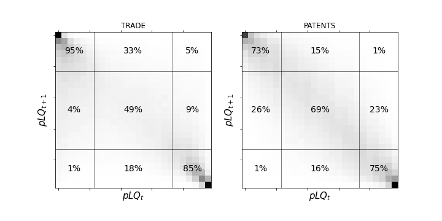

## Dynamics

Levels of **pLQ** can be considered as levels of **LQ** corrected by size effects. This section explores the persistence of pLQ levels through a Markovian transitions analysis. It reveals that pLQ levels near 0 and 1 are stable, while transitions between these extremes often involve intermediate values.

**Figure 1** below illustrates the relationship between $pLQ_t$ (horizontal axis) and $pLQ_{t+1}$ (vertical axis), resembling an empirical Markov matrix. Key observations include:

- **Stability**: Very low and high pLQ levels tend to remain stable over time.
- **Volatility**: Intermediate pLQ levels exhibit higher volatility, with significant chances of varying outcomes over time.

*Figure 1: Plot of an empirical Markov matrix showing pLQ next year as a function of pLQ this year. Both extremes show persistence, while the values in the middle show high volatility. The gray intensity denotes percentage probability in the Markov cell, from 0% (white) to 100% (black).*

### Categorizing pLQ Levels

By partitioning pLQ into three categories, we can derive further insights:

- **Low values**: $0 < \text{pLQ} < 0.25$
- **Medium or transition values**: $0.25 < \text{pLQ} < 0.75$
- **High values**: $0.75 < \text{pLQ} < 1$

This categorization allows the computation of a $3 \times 3$ Markov matrix, revealing:

- Significant probabilities of transitions between categories 1 and 2, and between categories 2 and 3.
- Reduced probabilities of direct transitions between categories 1 and 3 without passing through 2.

This suggests an ordering in LQ values, where the transition category acts as a stage for country-products moving between no-advantage and advantage statuses.

### Implications for Network Analysis

Studies using $LQ > 1$ for defining binary matrices and bipartite networks can leverage pLQ for a weighted bipartite network. This Markov analysis confirms that pLQ levels can define categorical values \{low, mid, high\} instead of binary \{0, 1\} values.