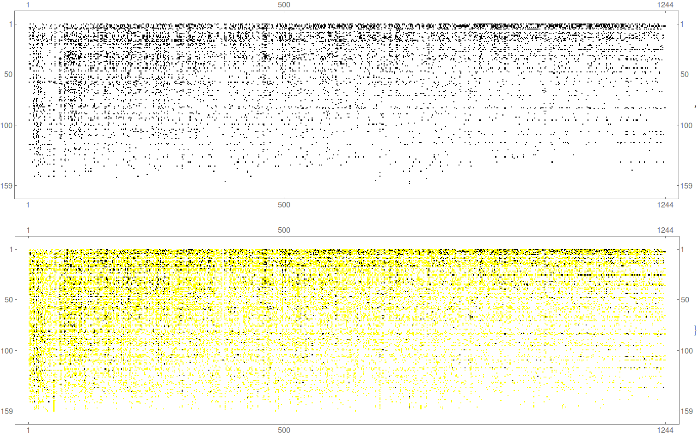

## pLQ as Continuous Generalization of $LQ > 1$

The $LQ > 1$ binary variable is typically used as a proxy to determine which entries in a contingency table are significant. The variable **pLQ** is defined to have a value between zero and one. Notably, pLQ takes intermediate values when $LQ \approx 1$ and approaches the binary 0 or 1 when far from the threshold (see **Figure 1**).

The $LQ > 1$ variable, when arranged in a rectangular matrix, can be interpreted as the adjacency matrix of an undirected bipartite network, as discussed by Hidalgo. By replacing $LQ > 1$ with pLQ, the matrix values extend beyond just {0, 1} to include all values in the interval [0, 1]. This allows it to be interpreted as a **weighted binary matrix**. The analysis of binary bipartite networks can thus be adapted to this more general case. For further insights into bipartite networks and their projections, refer to works by Latapy, Saracco, and Neal.

This consistent criterion can transform the binary LQ variable into a categorical one. **Figure 2** illustrates this transformation, plotting the matrix $M_{cp}$ (where rows represent countries and columns represent products) in both binary and categorical forms. An intermediate intensity category (in yellow) is introduced.

## Why pLQ is Useful

In summary, the curves of equal chances of being above the threshold account for size distortions. These level curves help classify parts of the space for the LQ problem into categories of increasing intensity (see **Figure 3**). Imagine the LQ space as a terrain where one measures elevation and estimates level curves. Instead of using coordinates, one works with heights from these curves. 

If unaware of size effects in location quotients, one might overlook the utility of this approach, mistakenly assuming LQ coordinates already measure intensity. However, LQ values alone do not form a consistent intensity scale. Classifying by levels of pLQ is crucial for establishing a consistent intensity scale across entities.