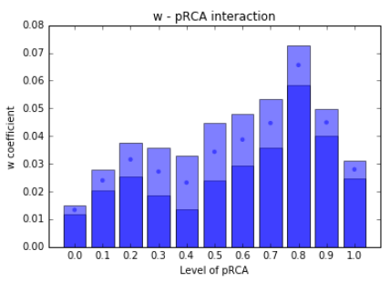

**pLQ as a Predictor for Diversification**

In this section, we explore how the **pLQ** (probability of Location Quotient) integrates into a framework for predicting diversification. We compare a fixed effects regression, inspired by Hausmann's approach, using both the binary $LQ > 1$ and pLQ. The second independent variable is proximity $w$.

*Proximities* are computed using the same operations but start from $LQ > 1$ and pLQ matrices respectively. These variables coincide for most practical purposes.

The regression equation includes dummies for each country-product and time period fixed effects:

$$
y_{it} = \alpha +\beta_1 x_{it} + \beta_2 w_{it}  + \pi_{i} \delta_{i} + \pi_{t} \delta_{t} + \epsilon_{it}
$$

- **$i$**: Represents a country-product.
- **$y_{it}$**: Dependent variable indicating if $LQ > 1$ for country-product $i$ at time $t+1$.
- **$\alpha$**: Intercept term.
- **$x_{it}$**: Refers to either pLQ or binary $LQ > 1$ for country-product $i$ at time $t$.
- **$\delta$**: Dummies for country-product and time step.
- **$\pi$**: Corresponding coefficients.
- **$\epsilon_{it}$**: Error term.

To manage the numerous dummies, we apply the within transformation:

$$
y^{*} = y -\bar{y_i} - \bar{y_t} + \bar{\bar{y}}
$$

This transformation 'sweeps' the $\pi_{i}$ and $\pi_{t}$ effects, allowing us to fit the within estimators $\tilde \beta$ using OLS:

$$
y^{*}_{it} = \tilde \beta_1 x^{*}_{it} + \tilde \beta_2 w^{*}_{it}  + \epsilon^{*}_{it}
$$

The results are summarized below:

| | Fitted Coefficients (1) | Fitted Coefficients (2) |
|---|---|---|
| Binary LQ ($\beta_1$) | 0.756 $\ast$ | |
| | (0.001) | |
| pLQ ($\beta_1$) | | 0.986$\ast$ |
| | | (0.001) |
| Density ($\beta_2$) | 0.065$\ast$ | 0.021$\ast$ |
| | (0.001) | (0.001) |
| Adj. R-squared | 0.682 | 0.623 |
| No. of Observations | 1,404,542 | 1,404,556 |

**Note**: *Statistically significant at the 0.01% level.*

We also examine if the role of density varies for different levels of pLQ. By applying a simple interaction with a dummy indicating the level of pLQ, the fitting equation becomes:

$$
y^{*}_{it} = \tilde \beta_1 x^{*}_{it} + \tilde \gamma_k w^{*}_{it} \delta_{k}  + \epsilon^{*}_{it}, \ \ k = 0, ..., 10
$$

The mean value and 2.5% - 97.5% confidence interval for all density coefficients $\gamma_k$ are plotted in the figure below. This suggests that density plays a more significant role for products slightly above the $LQ = 1$ threshold.

*A possible integration of this framework into similar regressions could involve assigning a value of 0.5 to indicate if a country exports a product with an intermediate level of LQ.*