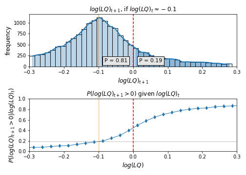

**Understanding the Propagation of Volatility in log(scp) to log(LQ)**

In the previous section, we explored the estimation of level curves of equal probability for surpassing the $LQ = 1$ threshold using a nearest neighbors (knn) fit. However, while a fitted knn model may align with empirical observations, it lacks analytical tractability. This section introduces a formal model to address this limitation, providing insights into the qualitative patterns of size distortions observed.

Growth of a variable over time, known as *log jumps*, is naturally linked to the variance (*volatility*) of the variable when considered as a time series around a stationary value. The goal of this section is to explore how jumps in variables $x_1$ and $x_2$ propagate to jumps in the variable $\log(LQ) = x_1 - x_2$.

The width of $\log(LQ)$ jumps (its volatility) is not the whole story. Whether a given jump results in $LQ_{t+1} > 1$ depends on the observation's position relative to the $LQ = 1$ line. By integrating growth distributions, we can estimate the likelihood of ending up with $LQ > 1$ after a time period, based on the starting point and the distribution of jumps in $x_1$ and $x_2$.

**Formalizing the Probability of Exceeding the Threshold**

Consider the setting in one dimension, focusing on $\log(LQ)$ before generalizing to two dimensions. The probability that $\log(LQ) > 0$ within a time period, known as pLQ, is linked to the growth distributions of $\log(LQ)$. If, after a time period, points near $LQ_{0}$ shift by $\Delta \log(LQ) = \log(LQ) - \log(LQ_0)$, distributed according to:

$$g_{0}(\Delta \log(LQ))$$

The condition $\log(LQ)_{t+1} > 0$ is fulfilled if:

$$\log(LQ)_t + \Delta \log(LQ) > 0 \quad \Longleftrightarrow \quad \Delta \log(LQ) > -\log(LQ)_t$$

To estimate pLQ, we weigh all possible jumps within a time period and sum the chances that $\Delta \log(LQ)$ exceeds the gap $-\log(LQ)_t$ to zero. Formally, the probability of a jump in LQ being sufficient to surpass the threshold is given by:

$$
pLQ(LQ_0) = \int\limits_{- \log(LQ_0)}^{\infty} g_{0} (\Delta \log(LQ)) \, d\log(LQ)
$$

This integration of growth distributions serves as an estimation of pLQ, as illustrated in **Figure 1**.

**Figure 1**: The top histogram shows where points near $\log(LQ) = -0.1$ ended up in the next period, representing an empirical version of the growth distribution $g_{p_0}$. Highlighted points surpass the $\log(LQ) = 0$ threshold. Their area equals the height of the corresponding dot in the lower plot, corresponding to the integral in equation integratepLQ1. The bottom plot shows probabilities that $LQ > 1$ in the next period as a function of $\log(LQ)$, similar to **Figure 2** but within a narrower range. The variable $T$ is aggregated for illustration.

**Footnotes**

1. When considering differences in log levels, satisfactory results require a nearly continuous support distribution. For count data, many observations fall below $n_{cp} = 10$ (see **Figures 3** and **4**), constraining log differences to a few values influenced by initial levels. Trade data typically shows larger figures (minimum of $10^3$ in our data), making it better suited for this analysis.