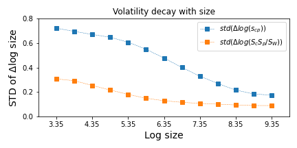
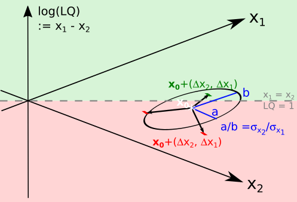
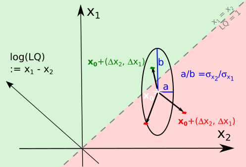

Let us now extend the reasoning to a description of observations in terms of the pair of variables $x_1 = \log(s_{cp})$ and $x_2 = \log\left( \frac{S_c S_p}{S_W} \right)$ that span the 2D space for the **LQ problem**. Points in these coordinates are denoted as $\textbf{x} = (x_2, x_1)$. The two-dimensional distribution of growth rates of these coordinates is denoted as $G_{0} (\Delta x_2, \Delta x_1)$, and the region where $x_1 > x_2$ is the two-dimensional plane region $R$ where $\log(s_{cp}) > \log\left( \frac{S_c S_p}{S_W} \right) \Rightarrow s_{cp} > \frac{S_c S_p}{S_W}$, i.e., **LQ > 1**. The growth cases resulting in the condition **LQ > 1** are, in calculus notation:

$$
pLQ(\textbf{x}_0) = \iint\limits_{R}  G_{0} (\Delta x_2, \Delta x_1) \ ( x_1 > x_2)  \ dR
$$

This integration would be approximated numerically. A practical way to do so is to store the 2D distribution of growth out of the $\textbf{x}$ coordinates in an array `G` and the condition $x_1 > x_2$ in another array `C` of the same shape. In this notation, the numerical integration can simply be:

$$
pLQ(\textbf{x}_0) = \text{(G * C).sum() / G.sum()}
$$

Before continuing with the strategy for estimation of two-dimensional growth probabilities `G`, let me emphasize that here we are propagating the volatility of observations and totals into volatility of LQ values.

### Volatility and Growth Distributions

First, note that the growth rates of $\log(s_{cp})$ are essentially proportional to the standard deviation $\sigma_{x_1} = \text{std}(\log(s_{cp}))$. This $\sigma_{x_1}$ is larger for smaller entities, but we need to propagate this $\sigma_{x_1}$ to the volatility of LQ values to conclude that smaller entities have higher $\log(LQ)$ jumps. Working with two-dimensional growth distributions as previously described addresses this generally. However, one can take variance in the definition $\log(LQ) := \log(s_{cp}) - (\log(S_c) + \log(S_p) - \log(S_w))$:

$$
\text{var}(\Delta \log(LQ)) = \text{var} (\Delta \log(s_{cp}) - \left[  \Delta \log(S_c) + \Delta \log(S_p) - \Delta \log(S_w) \right] )  = \text{var}(\Delta x_1 - \Delta x_2)
$$

In empirical settings, jumps in these two terms are largely independent, meaning $\text{cov}(\Delta x_1, \Delta x_2) \approx 0$, so:

$$
\text{var}(\Delta \log(LQ)) = \text{var}(\Delta x_1 - \Delta x_2) \approx \text{var}(\Delta x_1) + \text{var}(\Delta x_2)
$$

$$
\sigma_{\log(LQ)} = \text{std}(\Delta x_1 - \Delta x_2) \approx  \sqrt{ \sigma_{x_1} + \sigma_{x_2}  }
$$

### Volatility Decay with Size

It turns out that $\text{var}(\Delta x_1)$ and $\text{var}(\Delta x_2)$ are functions of $x_1$ and $x_2$, respectively. These volatilities are plotted in **Figure 1**. Larger nominal values fluctuate less in relative terms than smaller values, consistent with findings from Stanley et al. and others studying volatility decay with size. This dependence means that $\text{var}(\Delta \log(LQ))$ is a function of $x_1, x_2$, i.e., the sizes.

*Volatility versus size. Larger observations fluctuate less and are less likely to traverse a given gap in LQ levels. The standard deviation in these plots is the width of the axis of ellipses in the subsequent figures.*

### Ellipse Representation of Volatility

This expression of volatility of $\Delta \log(LQ)$ is linked to equations of ellipses. Using the notation $\sigma^2_{\log(LQ)} = \sigma^2_{x_1} + \sigma^2_{x_2}$ for variances of the jumps ($\Delta$), recall the equation of an ellipse centered at the origin is $k^2 = (x/a)^2 + (y/b)^2$ where $a$, $b$ are the semi-minor and major axes, and $k$ is a measure of ellipse size. Associating the ellipse axes with the width of jumps in $x_1$, $x_2$, the magnitude of $\Delta \log(LQ) = \Delta x_1 - \Delta x_2$ jumps is determined. These are the jumps in $\log(LQ)$, in the sense that $\log(LQ)_{t+1} = \log(LQ)_t + \Delta \log(LQ)$. See **Figure 2** for a schematic diagram.

 

*Scheme of jumps in observations after a time step. Using size factor $y_2 = (x_1 + x_2)/2$ and log(LQ) as axes (left) and observed and expected sizes $x_2, x_2$ as axes (right). The green regions are those where $LQ > 1$. The initial point $\bm{x_0}$ is shown with a white star. Around it, three purported jumps after a timestep are drawn. The ellipses indicate how far jumps are expected to stretch, in the directions $x_1$ and $x_2$ and thus in any other direction given by a combination of those.*

Finally, even after characterizing the widths of the jumps in $x_1$, $x_2$, and thus $\log(LQ)$, there remains a step to translate it into chances of surpassing the $LQ = 1$ threshold (pLQ). For that, let us return to our core goal of explaining pLQ by means of growth distributions. We need to count all cases where jumps have let $\log(LQ) > 1$.