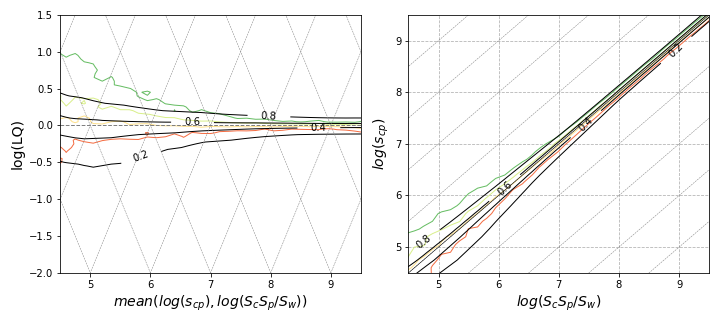

**Understanding the Probability of Surpassing the $LQ = 1$ Threshold**

To translate the characterization of jumps in $x_1$, $x_2$, and thus $\log(LQ)$ into the probability of surpassing the $LQ = 1$ threshold (denoted as pLQ), we need to focus on explaining pLQ through growth distributions. Our task is to count all cases where jumps result in $\log(LQ) > 1$.

### Integrating Growth Distributions

This involves integrating the growth distributions that describe the volatility of $x_1$ and $x_2$. For any initial point $x_1$, $x_2$, consider combinations of jumps in both $x_1$ and $x_2$ that might result in exceeding the threshold in the next timestep. If an observation is below the $LQ = 1$ threshold, it can surpass it by either $x_2$ shrinking enough or $x_1$ growing sufficiently. These represent the pure $x_1$, $x_2$ directions of the oblique axes in the plot (see **Figure: Coordinates**). Intermediate combinations of changes in $x_1$ and $x_2$, if intense enough, may also achieve this. The general accounting for these situations is done via integration in the equation for pLQ.

Assuming the growth rate distribution is separable, it can be expressed as a product of two one-dimensional marginal growth distributions: $G_{0} (\Delta x_2, \Delta x_1) = g_{x_2} (\Delta x_2) g_{x_1} (\Delta x_1)$. This is integrated numerically in the $x_1 > x_2$ region.

### Numerical Integration Procedure

For the numerical integration of these 2D growth rate probabilities, the following procedure is applied:

- **Binning Observations**: Observations are binned into intervals with centers $\{x_1\}$. By comparing observations at consecutive time periods, histograms of $\Delta x_1$ are observed for each bin. These histograms, normalized by bin population, estimate the assumed $g_{x_1} (\Delta x_1)$.
- **Creating Interpolators**: A 2D continuous interpolator $g_{x_1} (\Delta x_1)$ is created to estimate the chances of $x_1$ becoming $x_1 + \Delta x_1$ after one time period. The same procedure is applied to the $x_2$ variable.
- **Estimating $G_0$**: $G_0$ is estimated as $g_{x_2}  g_{x_1}$ for the chances of jumping in the 2D LQ plane.

The numerical integration is performed by evaluating growth rate interpolators on a fine grid covering a large rectangle about point $\textbf{x} = (x_2, x_1)$ and storing it in a 2D numpy array `G`. The condition $x_1 > x_2$ is stored in another array `C` of the same shape. The integration is computed as `(G * C).sum() / G.sum()`.

### Implications of Volatility Decay

The decay of volatility with size (see **Figure: Volatility Decay**) implies that larger observations and those from larger countries and products are less volatile. This feature results in a lower likelihood for a large observation $s_{1}$ to surpass $LQ = 1$, compared to a smaller observation $s_{2}$, given they start at the same $LQ < 1$ level.

**Figure: Growth Rate Model** illustrates the model of uncorrelated growth rates in the variables $x_1 = \log(s_{cp})$ and $x_2 = \log(S_c S_p / S_W)$. The ellipses depict the standard deviation of these variables. Changes in the transition width of pLQ can be qualitatively explained by the dependence of the moments $std(x_1)$ and $std(x_2)$ on $x_1$, $x_2$.

### Validating the Model

To validate this model for reconstructing pLQ, a comparison is made with level curves of pLQ from the knn estimator. A qualitative match is observed in the patterns of widening of the effective LQ metric with decreasing $x_1, x_2$ values. The transition $x_1 = x_2 = (x_1 + x_2)/2$ and size effects relevant to the $LQ = 1$ level can be evaluated by measuring $std(\Delta \log(s_{cp}))$ and $std(\Delta \log(S_c S_p / S_W))$ along this line.

Generalizing the paths suggested here may allow further exercises where the volatility in $\log(LQ)$ is explained by volatilities in all four sizes $\log(s_{cp})$, $\log(S_c)$, $\log(S_p)$, and $\log(S_W)$ separately. The formal tools can be extended to cover such settings, although the schemes may need to be adapted for four variables instead of two.